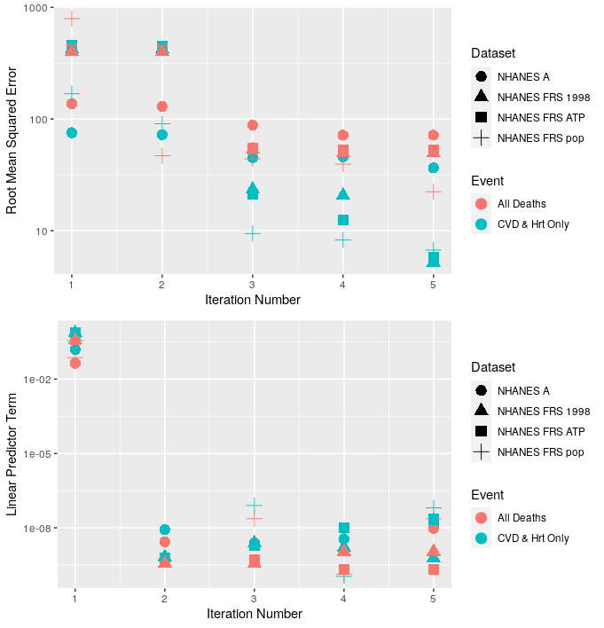
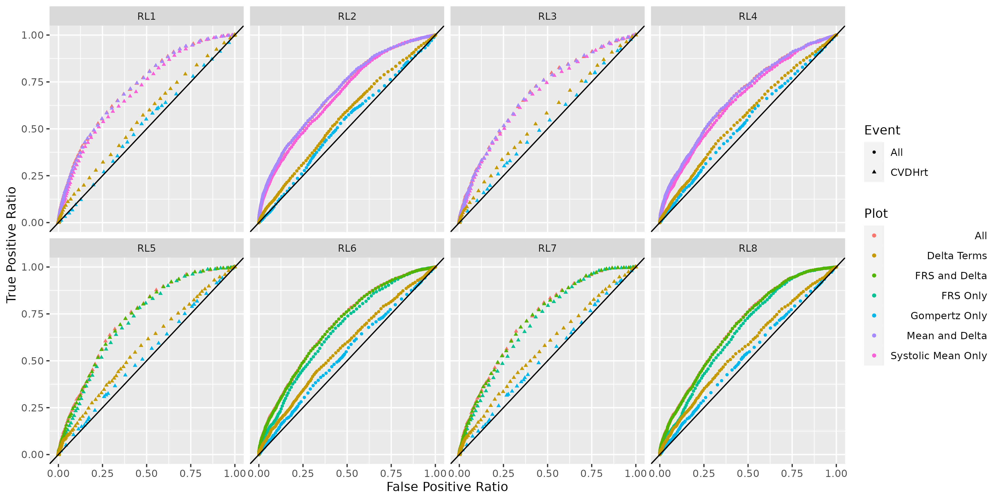
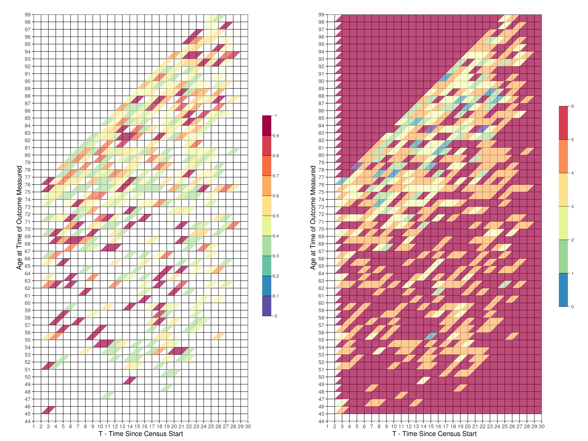

```{r setup, include=FALSE}
knitr::opts_chunk$set(echo = TRUE)
options(tinytex.verbose = TRUE)
library(tidyverse)
library(magrittr)
library(knitr)
library(tinytex)
library(kableExtra)
```

# Appendix A - Further Detail on Modelling and Results

This appendix aims to add more detail about the numerical modelling than was provided in the article. This is to ensure that the research methods are transparent and entirely reproducible. The numerical modelling presented in this paper was performed using R combined with Rstan. More detail will be provided here about the model, about the specific methodology used to parameterize the model, and more results are provided that were not included in the main bulk of the article.

## Model

The model used in this research is built from the theory of joint modelling of longitudinal and time-to-event data. This will be described in detail later on in this section, however, in brief, this allows the simultaneous modelling of both longitudinal observation data (in this article, this is blood pressure measurements) and also the time-to-event outcome (in this article, this is death or death from specifically Cardio-Vascular Disease - CVD - or heart attack).

### Survival Analysis (Time-to-Event)

The mathematical model applied in this research is underpinned by combining the Gompertz equation with Cox' proportional hazards model. The Gompertz equation 
\begin{equation}\label{gompertz}
h_0(t)=B\exp{\left(\theta(x+T)\right)},
\end{equation}
describes the baseline hazard of the population to a particular risk, which, for this article, investigates mortality from Cardio-Vascular Disease (CVD) and heart attack specifically, as well as studying mortality risk in general. $x\in\mathbb{N^N}$ is the age of the individual at the initial interview time, for $N$ the number of individuals, and $T\in\mathbb{R}^{+,N}$ the time since the individual entered the survey. $\boldsymbol{B}\in\mathbb{R}^{6}$ can be thought of as the initial hazard risk, where an individual at a very young age has a non-negligible level of mortality risk. However, in reality, there are fewer deaths at younger ages than older ones, so the model parameterization is more representative for older ages and therefore this initial hazard risk should not literally be taken as the mortality risk at young ages. $\theta\in\mathbb{R}^{6}$ is used to modify the magnitude of the change in baseline risk with time, such that risk increases exponentially at older ages and for a large amount of time since the blood pressure measurements were made. Note that both $B$ and $\theta$ have 6 different values, depending on the sex assigned at birth - female or male - or the race - black, white or 'other'. Note that 'other' in the race category is a combination of all non-black or non-white races, such as hispanic populations. Cox's proportional hazards model links the covariates of the model (mean systolic blood pressure, variance in the diastolic blood pressure, etc) to the survival outcome of the individual via the equation
\begin{equation}\label{prophaz}
h(t)=h_0(t)\exp{\left(\boldsymbol{\beta}\cdot(\boldsymbol{X}-\hat{\boldsymbol{X}})\right)},
\end{equation}
where $\boldsymbol{X}\in\mathbb{R}^{+,N\times d}$ is a vector of summary statistics of the blood pressure measurements of individual covariates in our model, $\hat{\boldsymbol{X}}\in\mathbb{R}^{+,d}$ is the centering of the covariates such that the equation $\sum_i^N \exp{(\boldsymbol{\beta}\cdot(\boldsymbol{X}-\hat{\boldsymbol{X}}))}=0$ is approximately satisfied (more on this later), and $\boldsymbol{\beta}\in\mathbb{R}^d$ implies the strength of the influence of the covariate on the mortality risk. The particularly useful feature of using the Cox' proportional hazards model is that censoring can be accounted for, where $\delta\in{0,1}$ indicates whether the individual died within the total census period $T_c$, whereby $T\leq T_C$ if $\delta=1$. In this study, we explored the following covariates:

```{r, include=FALSE}
DF<-data.frame(varnames=c("$FRS-1998$",
                          "$FRS-ATP$",
                          "$M_S$",
                          "$M_D$",
                          "$\\Delta_S$",
                          "$\\Delta_D$",
                          "$\\sigma_{\\{S,H\\}}$",
                          "$\\sigma_{\\{D,H\\}}$",
                          "$\\sigma_{\\{S,C\\}}$",
                          "$\\sigma_{\\{D,C\\}}$",
                          "$\\tau_{\\{S,H\\}}$",
                          "$\\tau_{\\{D,H\\}}$",
                          "$\\tau_{\\{S,C\\}}$",
                          "$\\tau_{\\{D,C\\}}$"),
               support=c("$R^N$",
                         "$R^N$",
                         "$R^{+,N}$",
                         "$R^{+,N}$",
                         "$R^{+,N}$",
                         "$R^{+,N}$",
                         "$R^{+,N}$",
                         "$R^{+,N}$",
                         "$R^{+,N}$",
                         "$R^{+,N}$",
                         "$R^{+,N}$",
                         "$R^{+,N}$",
                         "$R^{+,N}$",
                         "$R^{+,N}$"),
               desc=c("1998 version of the FRS score",
                      "ATP version of the FRS score",
                      "Mean systolic blood pressure",
                      "Mean diastolic blood pressure",
                      "Absolute value of the difference in the Home-Clinic systolic blood pressure",
                      "Absolute value of the difference in the Home-Clinic diastolic blood pressure",
                      "Standard deviation of the systolic blood pressure taken at home",
                      "Standard deviation of the diastolic blood pressure taken at home",
                      "Standard deviation of the systolic blood pressure taken at the clinic",
                      "Standard deviation of the diastolic blood pressure taken at the clinic",
                      "Precision of the systolic blood pressure taken at home",
                      "Precision of the diastolic blood pressure taken at home",
                      "Precision of the systolic blood pressure taken at the clinic",
                      "Precision of the diastolic blood pressure taken at the clinic"))

```

```{r, echo=F, label= "runnumers"}
kable(DF,col.names = c("Variable Name", "Support", "Description"),
format="latex", escape = F,booktabs = T)

```

Please note that the last four elements of this list, the precision values, were only carried out to ensure model consistency with the use of standard deviation instead. For the parameterisation of this model, we assume that the gompertz parameters and the parameters in the linear predictor term are distributed as follows:
\begin{equation}\label{priorsS}
\begin{aligned}
  \boldsymbol{B}\sim\mathbb{C}(\mu_B,\sigma_B),\\
  \boldsymbol{\theta}\sim\mathbb{N}(\mu_\theta,\sigma_\theta),\\
  \boldsymbol{\beta}\sim \mathbb{N}(\mu_\beta,\sigma_\beta),
\end{aligned}
\end{equation}
noting that $\mathbb{C}(\mu,\sigma)$ is the Cauchy distribution. \\

The likelihood for this Gompertz-Cox' proportional hazards model, over all individuals in the census, is as follows:
\begin{equation}\label{likesurv}
L_S(\boldsymbol{v},\boldsymbol{\delta})=\prod_i^N f(v_i,\delta_i|B_i,\theta_i,\beta_i,\boldsymbol{X},\hat{\boldsymbol{X}})=\prod_i^N h(v_i|B_i,\theta_i,\beta_i,\boldsymbol{X},\hat{\boldsymbol{X}})^{\delta_i} \exp{\left( -\sum_i^N H(v_i|B_i,\theta_i,\beta_i,\boldsymbol{X},\hat{\boldsymbol{X}}) \right)},
\end{equation}
with $H(v)=\int_0^v h(w)dw$ the cumulative hazard.

### Longitudinal Modelling

Alongside the time-to-event prediction, we simulataneously estimate the blood pressure outcomes of each individual throughout the census time. Let $Y_i(t_j)$ be the observed blood pressure for patient $i$ at time $t_j$, for the individual $i\in 1,2,...,N$ and the number of blood pressure measurements per individual $j\in 1,2,...,k$. Due to the fact that the blood pressure measurement data was taken at both the home and clinic (written using subscripts H and C, respectively), with approximately 6 months between these two measurements, we model the blood pressure using the following model, assuming the diastolic $Y_{i}^D$ and systolic $Y_{i}^S$ blood pressure to be Gaussian-distributed:
\begin{equation}\label{bp}
\begin{aligned}
  (Y_{i}^D)_{H} \sim \mathbb{N}(M_i^D+\Delta_i^D,(\sigma_i^D)_H),\\
  (Y_{i}^D)_{C} \sim \mathbb{N}(M_i^D-\Delta_i^D,(\sigma_i^D)_C),\\
  (Y_{i}^S)_{H} \sim \mathbb{N}(M_i^S+\Delta_i^S,(\sigma_i^S)_H),\\
  (Y_{i}^S)_{C} \sim \mathbb{N}(M_i^S-\Delta_i^S,(\sigma_i^S)_C),
\end{aligned}
\end{equation}
where superscripts $D$ and $S$ refer to diastolic and systolic blood pressure, respectively. We assume the blood pressure parameters are distributed according to
\begin{equation}\label{priorsL}
\begin{aligned}
  M_i^{\{D,S\}}\sim \mathbb{N}(\mu_M^{\{D,S\}},\sigma_M^{\{D,S\}}),\\
  \Delta_i^{\{D,S\}}\sim \mathbb{N}(\mu_D^{\{D,S\}},\sigma_D^{\{D,S\}}),\\
  \sigma_{i,C}^{\{D,S\}}\sim \Gamma(r_C^{\{D,S\}},\lambda_C^{\{D,S\}}),\\
  \sigma_{i,H}^{\{D,S\}}\sim \Gamma(r_H^{\{D,S\}},\lambda_H^{\{D,S\}}),
\end{aligned}
\end{equation}
Noting that this assumes that the distribution of the individual blood pressure parameters are sampled from a population-level distribution of parameters. The longitudinal outcome modelling therefore aims to infer the distributions of the individual blood pressure parameters
\begin{equation}
  \Theta=\left\{\mu_M^{\{D,S\}},\mu_D^{\{D,S\}},\sigma_M^{\{D,S\}},\sigma_D^{\{D,S\}},r_C^{\{D,S\}},\lambda_C^{\{D,S\}},r_H^{\{D,S\}},\lambda_H^{\{D,S\}}\right\}
\end{equation}
Note that this kind of formulation of the problem is known as a hierarchical model. The likelihood for the longitudinal measurements is therefore (combining the systolic and diastolic into a single parameter for simplicity):
\begin{equation}\label{likelong}
  L_L(\vec{\Theta}|\vec{Y})=\prod_{i=1}^N\left(\prod_{j=1}^{k}f(y_{ij}|M_i,\Delta_i,\sigma_i)\right)f(M_i|\mu_M,\sigma_M)f(\Delta_i|\mu_D,\sigma_D)f(\tau_{i,C}|r_C,\lambda_C)f(\tau_{i,H}|r_H,\lambda_H)
\end{equation}

### Bayesian Hierarchical Model

Combining the longitudinal outcome and time-to-event partial likelihoods, and for a given parameter space value of $\Omega=\{\beta,B,\theta\}\cup \Theta$, the joint-modelling likelihood (combining systolic and diastolic into one term for simplicity) is
\begin{equation}
  L(\vec{\Omega}|\vec{Y})=\prod_{i=1}^N\left(\prod_{j=1}^{k}f(y_{ij}|M_i,\Delta_i,\sigma_i)\right)f(v_i,\delta_i|B_i,\theta_i,\beta_i,\boldsymbol{X},\hat{\boldsymbol{X}})f(M_i|\mu_M,\sigma_M)f(\Delta_i|\mu_D,\sigma_D)f(\tau_{i,C}|r_C,\lambda_C)f(\tau_{i,H}|r_H,\lambda_H).
\end{equation}
By assuming that each of the parameters in our model, $\Omega$, are parameterised by chosen distributions, as defined in equations \ref{priorsS} and \ref{priorsL} with the given set of hyperparameters 
\begin{equation}
  \Omega_H=\{\mu_B,\sigma_B,\mu_\theta,\sigma_\theta,\mu_\beta,\sigma_\beta,\mu_M^{\{D,S\}},\sigma_M^{\{D,S\}},\mu_D^{\{D,S\}},\sigma_D^{\{D,S\}},r_C^{\{D,S\}},\lambda_C^{\{D,S\}},r_H^{\{D,S\}},\lambda_H^{\{D,S\}}\}
\end{equation}
then we can utilise Bayes' theorem to inform the parameterization of our model. Bayes' theorem can be written as 
\begin{equation}
\pi(Y|\Omega_p)=\frac{\pi(\Omega_p|Y)\pi(\Omega_p)}{\pi(Y)}, 
\end{equation}
for observational data $Y$, parameter set $\Omega_p$, $\pi(Y|\Omega_p)$ the posterior distribution, $\pi(\Omega_p|Y)$ the likelihood, $\pi(\Omega_p)$ the prior distribution and $\pi(Y)$ the marginal likelihood. This allows us to include informative knowledge on the model parameter distributions which then acts to inform the parameterization of the model using the applied methodology. The hyperparameters for the longitudinal model are calculated from the data directly, a method known as empirical Bayes'. This is described in detail later, in the Methodology section. For the time-to-event parameters, we choose $\mu_B=\mu_\theta=\mu_\beta=0$ and $\sigma_B=\sigma_\theta=2$ and $\sigma_\beta=100$.

### Proposed Models

In this article, we researched into 16 models, but made a focus on 8 of them. The 8 main models use the standard deviation, $\sigma$, as the measure of the influence of blood-pressure variability on mortality. We also produced the same 8 models but using precision, $\tau$, as the measure of the influence of blood-pressure variability on mortality. However, this was only to ensure that there were no differences between the use of one over the other. Throughout the remainder of this appendix, we refer to the 8 main models using the following run numbers:

\begin{enumerate}
\item All participants (15,295), using mean systolic and diastolic blood pressure (not FRS) in the linear predictor term, with the outcome data as death specifically from CVD or heart attack.
\item All participants (15,295), using mean systolic and diastolic blood pressure (not FRS) in the linear predictor term, with the outcome data as all-causes of death.
\item Only participants that had FRS values (9,418), but using mean systolic and diastolic blood pressure (not FRS) in the linear predictor term, with the outcome data as death specifically from CVD or heart attack.
\item Only participants that had FRS values (9,418), but using mean systolic and diastolic blood pressure (not FRS) in the linear predictor term, with the outcome data as all-causes of death.
\item Only participants that had FRS values (9,418), and using the FRS ATP-III value in the linear predictor term, with the outcome data as death specifically from CVD or heart attack.
\item Only participants that had FRS values (9,418), and using the FRS ATP-III value in the linear predictor term, with the outcome data as all-causes of death.
\item Only participants that had FRS values (9,418), and using the FRS 1998-version value in the linear predictor term, with the outcome data as death specifically from CVD or heart attack.
\item Only participants that had FRS values (9,418), and using the FRS 1998-version value in the linear predictor term, with the outcome data as all-causes of death.
\label{tab:runnums}
\end{enumerate}

We also include Directed Acyclical Graph (DAG) plots to help visualise the different models, as shown in figures \ref{fig:DAGmean} and \ref{fig:DAGFRS}. In order to read the DAGs, note that each square background layer that appears as a stack of layers represents different measured outcomes that were made during the census. The outcome variables measured are represented by a square-shaped text box, and a parameter of the model is represented by a circular-shaped text box. If either a square or circular text box is placed on top of a stacked rectangular layer, it means that multiple values of that variable (as many as there are layers to the stack) are either measured (for outcome variables) or produced (for parameters of the model). Please note that the number of layers in the stack is written in the text box that does not contain a frame which is intentionally displayed on top of the stacked layer that it represents. For example, $i=1,...,N$. Finally, the direction of the arrows implies causality assumed in the model.

{#fig:DAGmean}

{#fig:DAGFRS}

## Methodology

The methodology for this research can be split into three main sections: 1) calculating the empirical Bayes' parameters, 2) parameterizing the model using Hamiltonian Monte Carlo (HMC) and 3) re-centering the variables in the linear predictor equation. By applying empirical Bayes', Maximum Likelihood Estimates (MLEs) of some of the parameter distributions are provided. Note that the parameters estimated here are only the prior distribution of the global (not individual) blood pressure means and the variances, for both systolic and diastolic and home and clinic measurements. These estimates are then provided as prior distributions for the Stan MCMC simulations using HMC, where estimates can be made for all the parameter distributions of the model, given the specific centering applied. Finally, section (3) recalculates the centering values based on the previous MCMC iteration, and sets of the next iteration, whilst simultaneously checking for convergence in both the MCMC simulations and the centering values.

### Empirical Bayes' Parameters

We begin by assuming $y_{ij}^l$ observed directly. We estimate
by maximising the partial likelihood on the observations
\begin{align*}
  \bar{y}_{i+}&:= \frac{1}{2k} \sum_{j=1}^k y_{ij}^1 + y_{ij}^2,\\
  \bar{y}_{i-}&:= \frac{1}{2k} \sum_{j=1}^k y_{ij}^1 - y_{ij}^2,\\
  s_i^l&:=  \frac{1}{k-1}\sum_{j=1}^k \Bigl( y_{ij}^l - \frac{1}{k} \sum_{j=1}^k y_{ij}^l \Bigr)^2.
\end{align*}
Note that 
\begin{equation}
(k-1)s_i^l \tau_i^l =\sum_{j=1}^k \Bigl( z_{ij}^l - \frac{1}{k} \sum_{j=1}^k z_{ij}^l \Bigr)^2.
\end{equation} 
where $z_{ij}^l$ are i.i.d.\ standard normal
is independent of $\tau_i^l$, thus has a chi-squared distribution
with $k-1$ degrees of freedom --- hence $\frac{k-1}{2}\cdot s_i^l\tau_i^l$ is
gamma distributed with parameters $(\frac{k-1}{2},1)$. Since $\frac{\alpha}{\theta}\tau_i^l$ is independent of $s_i^l\tau_i^l$, with $\mathrm{Gamma}(\alpha,1)$ distribution, we see that $\frac{\theta(k-1)}{2\alpha}s_i^l$ is the ratio of two independent gamma random variables, hence has beta-prime distribution with parameters $\left(\frac{k-1}{2}, \alpha \right)$, so log partial likelihood
\begin{equation}
  \ell_{\operatorname{Beta}}(\alpha,\theta;s^l_\cdot)=n\alpha \log\frac{\alpha}{\theta}+n\log\Gamma\left(\alpha+\frac{k-1}{2}\right)-n\log\Gamma(\alpha)
  + \frac{k-1}{2} \sum_{i=1}^n \log s_i^l -\left(\alpha+\frac{k-1}{2}\right) \sum_{i=1}^n \log \left(s_i^l+\frac\alpha\theta\right).
\end{equation}

The partial Fisher Information has entries
\begin{align*}
 -\frac{\partial^2 \ell}{\partial \alpha^2} &= n\psi_1\left(\alpha\right) - n\psi_1\left(\alpha+\frac{k-1}{2}\right)
  - \frac{n}{\alpha} +\sum_{i=1}^n \frac{2\theta s_i^l + \alpha-(k-1)/2}{(\theta s_i^l + \alpha)^2}\\
-\frac{\partial^2 \ell}{\partial \theta^2} &=
   -\frac{n \alpha}{\theta^2} +\frac{\alpha}{\theta^2}\left(\alpha+\frac{k-1}{2}\right)\sum_{i=1}^n \frac{2\theta s_i^l + \alpha}{(\theta s_i^l + \alpha)^2}\\
-\frac{\partial^2 \ell}{\partial \theta\partial\alpha} &= \frac{n}{\theta}-
   \frac1\theta \sum_{i=1}^n \frac{\alpha^2+2\alpha\theta s_i^l+\frac{k-1}{2}\theta s_i^l}{(\theta s_i^l + \alpha)^2}.
\end{align*}
where $\psi_1$ is the trigamma function.

Let $(\hat\alpha^l,\hat\beta^l)$ be the maximum partial likelihood estimators. Conditioned on $(\tau_i^l)$ we have
\begin{align*}
  \bar{y}_{i+}&\sim \mathcal{N}\left(m_M, \sigma^2_M + \frac{1}{4k}\left( \frac{1}{\tau_i^1}+\frac{1}{\tau_i^2}\right)\right),\\
  \bar{y}_{i-}&\sim \mathcal{N}\left(m_\Delta,\sigma^2_\Delta + \frac{1}{4k}\left( \frac{1}{\tau_i^1}+\frac{1}{\tau_i^2}\right)\right).
\end{align*}
We would then have MLEs
\begin{align*}
  \hat{m}_M&= \frac{1}{n} \sum_{i=1}^n \bar{y}_{i+},\\
  \hat{m}_\Delta&= \frac{1}{n} \sum_{i=1}^n \bar{y}_{i-},
\end{align*}
which are approximately normally distributed, with means $m_M$ and $m_\Delta$ respectively, and conditional on $\tau_i^l$ standard errors
\begin{equation}
  \frac{\sigma_M^2}{n}+\frac{1}{4kn^2} \sum_{i=1}^n (\tau_i^1)^{-1} + (\tau_i^2)^{-1} \quad \text{ and } \quad
  \frac{\sigma_\Delta^2}{n}+\frac{1}{4kn^2} \sum_{i=1}^n (\tau_i^1)^{-1} + (\tau_i^2)^{-1},
\end{equation}
which we may approximate --- with error on the order of $n^{-3/2}$ --- replacing the mean of $(\tau_i^l)^{-1}$ by its expected value $\beta^l/(\alpha^l-1)$ to obtain
\begin{align*}
  \mathrm{Var}(\hat{m}_M) &\approx \frac{\sigma_M^2}{n}+\frac{1}{4kn}\left( \frac{\beta^1}{\alpha^1-1}+ \frac{\beta^2}{\alpha^2-1}\right) \\
  \mathrm{Var}(\hat{m}_\Delta) &\approx \frac{\sigma_\Delta^2}{n}+\frac{1}{4kn}\left( \frac{\beta^1}{\alpha^1-1}+ \frac{\beta^2}{\alpha^2-1}\right) 
\end{align*}
Finally, conditioned on the $\tau_i^l$ we have that the random variables $\bar{y}_{i+}$ are normal with variance
\begin{equation}
  \sigma_M^2+\frac{1}{4k}\left((\tau_i^1)^{-1} + (\tau_i^1)^{-1} \right),
\end{equation}
so the unconditional variance is the expected value, or
\begin{equation}
  \sigma_M^2+\frac{1}{4k}\left(\frac{\beta^1}{\alpha^1-1}+ \frac{\beta^2}{\alpha^2-1} \right).
\end{equation}
This yields the estimators
\begin{align*}
  \hat\sigma_M^2 &=\frac{1}{n-1}\sum_{i=1}^n\left(\bar{y}_{i+}-n^{-1}\sum_{i=1}^n y_{i+}\right)^2 - \frac{1}{4k}\left(\frac{\hat\beta^1}{\hat\alpha^1-1}+ \frac{\hat\beta^2}{\hat\alpha^2-1} \right),\\
  \hat\sigma_\Delta^2 &=\frac{1}{n-1}\sum_{i=1}^n\left(\bar{y}_{i-}-n^{-1}\sum_{i=1}^n y_{i-}\right)^2 - \frac{1}{4k}\left(\frac{\hat\beta^1}{\hat\alpha^1-1}+ \frac{\hat\beta^2}{\hat\alpha^2-1} \right).
\end{align*}
Using the delta method, and the fact that  we see that the variance of $\hat\beta/(\hat\alpha-1)$ is approximately
\begin{equation}
  \frac{\sigma_\beta^2}{(\hat\alpha-1)^2} + \frac{\hat\beta^2\sigma_\alpha^2}{(\hat\alpha-1)^4},
\end{equation}
where $\sigma_\alpha$ and $\sigma_\beta$ are the standard errors for $\hat\alpha$ and $\hat\beta$ respectively, so the standard errors for $\hat\sigma_M^2$ and $\hat\sigma_\Delta^2$ are approximately
\begin{align*}
  \operatorname{SE}\left(\hat\sigma_M^2\right)&\approx \frac{1}{2k}\Bigl(\frac{8k^2\hat\sigma_M^2}{n} + \frac{\sigma_\beta^2}{(\hat\alpha^1-1)^2} + \frac{(\hat\beta^1)^2\sigma_\alpha^2}{(\hat\alpha^1-1)^4} + \frac{\sigma_\beta^2}{(\hat\alpha^2-1)^2} + \frac{(\hat\beta^2)^2\sigma_\alpha^2}{(\hat\alpha^2-1)^4} \Bigr)^{1/2},\\
  \operatorname{SE}\left(\hat\sigma_\Delta^2\right)&\approx \frac{1}{2k}\Bigl(\frac{8k^2\hat\sigma_\Delta^2}{n} + \frac{\sigma_\beta^2}{(\hat\alpha^1-1)^2} + \frac{(\hat\beta^1)^2\sigma_\alpha^2}{(\hat\alpha^1-1)^4} + \frac{\sigma_\beta^2}{(\hat\alpha^2-1)^2} + \frac{(\hat\beta^2)^2\sigma_\alpha^2}{(\hat\alpha^2-1)^4} \Bigr)^{1/2}
\end{align*}

For a parameter like $\alpha$ we estimate the variance of $\hat\alpha$ by
\newcommand{\E}{\mathbb{E}}
\renewcommand{\P}{\mathbb{P}}
\begin{equation}
  \mathrm{Var}(\hat\alpha) = \mathbb{E}\bigl[ \mathrm{Var}\left(\hat\alpha\, |\, I\right)\bigr] + \mathrm{Var}\left(\mathbb{E} \left[ \hat\alpha\, |\, I \right]\right).
\end{equation}
Here $I$ represents the randomly imputed fractional part. 
We can estimate the first term by averaging the estimated variance (from Fisher Information) over all random imputations.
We estimate the second term by the variance of the $\alpha$ estimates over imputations. Note that this is not quite right, since what we really
want the variance of is $\alpha_0(I)$ --- effectively, the 'true' parameter consistent with the imputation. This is a plug-in estimate,
as is the Fisher Information estimate of the variance.

To computing the residuals, we define the deviance for an individual $i$ with observations $(Y_i)$
given the hyperparameters $h=(m_M,m_\Delta,\sigma^2_M,\sigma^2_\Delta,\alpha^H,\theta^H,\alpha^C,\theta^C)$
\begin{equation}
  D= \sum_{i=1}^n \log \mathbb{P}\left\{ \mathbf{Y}_{i}\,|\, \text{hyperparameters}=h\right\}.
\end{equation}
\newcommand{\wtb}{\widetilde\mathbf}
Since the $\mathbf{Y}_i$ are independent conditioned on $h$,
\begin{align*}
D&= \sum_{i=1}^n \log \E_h\left[ \P\left\{ \mathbf{Y}_i \, |\, M_i,\Delta_i,\tau_i^{C},\tau_i^H \right\} \right]\\
    &\approx \sum_{i=1}^n \log \frac1R\sum_{r=1}^R \left[ \P\left\{ \mathbf{Y}_i \, |\, M_{i,r},\Delta_{i,r},\tau_{i,r}^{C},\tau_{i,r}^{H} \right\}\right] \frac{\pi_h(M_{i,r},\Delta_{i,r},\tau_{i,r}^{C},\tau_{i,r}^{H} )}{q(M_{i,r},\Delta_{i,r},\tau_{i,r}^{C},\tau_{i,r}^{H} \, | \, h,\, \mathbf{Y}_i)},
\end{align*}
where $(M_{i,r},\Delta_{i,r},\tau_{i,r}^{C},\tau_{i,r}^{H})$ are independent samples from a distribution $q$ that may depend
on $\mathbf{Y}_i$ and $h$, and $\pi_h$ is the true density of those individual parameters given hyperparameters $h$.

### Hamiltonian Monte Carlo (HMC)

The model, as described in the article, is a Bayesian hierarchical model. In order to parameterize such an intricate model, traditional Maximum Likelihood Estimation methods can no longer be applied. Therefore, we apply the Hamiltonian Monte Carlo (HMC) method. HMC is a form of Markov Chain Monte Carlo methods, which samples potential parameter space values of the model, then calculates directly the likelihood function based on that choice of parameters. The derivative of the likelihood function, $\phi$, guides parameter space exploration in $\theta$ towards the modal value of the joint posterior distribution. This method is ideal for complicated, non-Gaussian distribution forms. The three steps of HMC are:
\begin{enumerate}
\item Draw a sample of the derivative $\phi$ using the posterior distribution of $\phi$, which is the same as its prior.
\item Update the values of $\theta^*$ and $\phi^*$ using
  \begin{equation}
    \theta^*\leftarrow \theta+\epsilon M^{-1}\phi,
  \end{equation}
  and
  \begin{equation}
    \phi\leftarrow \phi+\epsilon\frac{1}{2}\frac{d\log\{p(\theta|y)\}}{d\theta},
  \end{equation}
where $M$ is the jacobian of the parameters. This can be set to a diagonal matrix for no correlation between parameters, and is pointwise updated throughout the calculation. This is the leapfrog method, whereby $\epsilon$ dictates the scale size of the step to ensure convergence on the correct point is made, and L is the number of steps to be `leaped'.
\item Compute the rejection parameter:
  \begin{equation}
    r=\frac{p(\theta^*|y)p(\phi^*)}{p(\theta^{t-1}|y)p(\phi^{t-1})}
  \end{equation}
\item Set $\theta^t$ to $\theta^*$ with probability $\min\{1,r\}$, or otherwise keep $\theta^{t-1}$.
\end{enumerate}  
The tuning parameters $\epsilon$ and L should be chosen according to a desired acceptance rate. The No-U-Turn Sampler of Stan automates the calculation of these tuning parameters. A more detailed overview of HMC and the NUTS algorithm integrated into the Stan package, see *'The No-U-Turn Sampler: Adaptively Setting Path Lengths
in Hamiltonian Monte Carlo'* by M. Hoffman and A. Gelman, Journal of Machine Learning Research, 15, 1351-1381 (2014).

### Centering the Linear Predictor

During the MCMC simulations, the centering values play a non-negligible role in shaping the model parameterization. If the centering parameters are held constant throughout all of the MCMC simulations, then the equation $\sum_i^N \exp{(\boldsymbol{\beta}\cdot(\boldsymbol{X}-\hat{X}))}=0$ is no longer guaranteed. However, automatically defining the centering values based on the model parameters sampled at the current MCMC iteration is not advisable as it can lead to poor parameter convergence. This is because it modifies the likelihood function at every MCMC iteration. Therefore, we iterate the MCMC algorithm multiple times. At every iteration, we recalculate the centering parameters to satisfy the requirement that the average of the linear predictor term going to zero, based on the posterior distributions of the previous MCMC simulation. This iteration is carried out until the centering parameters converge. Convergence is defined by optimising on two factors. The first is that the sum of the linear predictor term across all MCMC samples needs to tend to negligible values (we define this as the average difference being less than $10^{-7}$), see figure \ref{fig:linpred_conv}. The second convergence criteria is that the average Root Mean-Squared Error (RMSE) of the model predictions on the survival outcomes in the MCMC simulations needs to also decrease towards zero, see figure \ref{fig:linpred_conv} (top). For the second criteria, we stopped the simulations when either the difference in the RMSE stopped decreasing (below a threshold of $1\%$), or the RMSE value was less than 20, see figure \ref{fig:linpred_conv} (bottom). Illustration of the convergence is shown in figure \ref{fig:linpred_conv}.

## Code Description

The code can be found at [https://github.com/hamishwp/Nhanes2021](https://github.com/hamishwp/Nhanes2021). The numerical code has been built in multiple stages. Below, we explain the principal files required to replicate the entire analysis presented in the article. There are 5 main groups for the code:

1. Data cleaning scripts
2. Main file
3. Stan files for HMC
4. Centering recalculation scripts
5. Post-processing analysis

We provide a brief description of each of these below.

### Data Cleaning
This is found in the file `Dataclean2021.R`. Provided the raw NHANES dataset (in CSV format), it extracts all the data required for the simulations, and stores it in a structure that can be directly read in to the main file (`MCMC_DiasSyst_v3.R`) of this research. 

### Main
The main file is `MCMC_DiasSyst_v3.R`. It reads in the cleaned NHANES data, the specific choice of simulation parameters (for example, whether to use the FRS number or mean systolic & diastolic blood pressure), and runs the correct RStan scripts for that specific selection of simulation parameters. This script is intended for use on computing clusters.

### Stan

There are eight Stan files: 

1. `mystanmodel_DS_sigma_v2_autopred.stan` 
2. `mystanmodel_DS_tau_v2_autopred.stan` 
3. `mystanmodelFRS_DS_sigma_v2_autopred.stan` 
4. `mystanmodelFRS_DS_tau_v2_autopred.stan`
5. `mystanmodel_DS_sigma_v2.stan` 
6. `mystanmodel_DS_tau_v2.stan`
7. `mystanmodelFRS_DS_sigma_v2.stan`
8. `mystanmodelFRS_DS_tau_v2.stan`

These correspond to the following alternative simulation parameters:

* For the blood-pressure variability, choosing to use the standard-deviation $\sigma$ or the precision $\tau=1/\sigma$]}
* Using the FRS score or the mean diastolic and systolic blood pressure as a covariate in the analysis
* Whether the centering parameters, $\hat{X}$, in the linear predictor term are automatically calculated to satisfy $\sum_i^N \exp{(\boldsymbol{\beta}\cdot(\boldsymbol{X}-\hat{X}))}=0$ for every MCMC iteration, or whether the centering is held constant across all iterations

### Centering
The centering of the linear predictors, which is required as input to every MCMC simulation iteration, is recalculated in the files `AutoPred_Recalc.R` and `ManPred_Recalc.R`. This is then provided to the Main script, `MCMC_DiasSyst_v3.R`, which provides these centering values to the Stan code for the MCMC simulations.

### Empirical Bayes Estimation
The file `gamma_fits.Rmd` contains all the necessary routines in order to replicate the calculation of the empirical Bayes' priors for the hyperparameters of the model.

###Post-processing
The post-processing script is called `PostProcessing.R`, which heavily relies on the `Functions.R` script which contains all the necessary functions to analyse the data. The post-processing script generates many useful plots of the MCMC posterior distribution for the user, including Bayes' factors, violin plots of the normalised beta and gompertz posteriors, and more.

## Results

In this section, we add some additional detail to the results section covered in the article. Extra information is given to explain how convergence of the simulations was ensured, and to also include more visualisations of the converged model parameterizations. The authors feel that this is particularly useful to provide confidence in the model parameterization and the predictions.

### Convergence of Simulations

Convergence of the simulations required to parameterize the model presented in this work is required for the MCMC simulations performed by Stan, as well as convergence in the centering values that requires repeating the Stan calculations several times. Convergence of the latter is shown in figure \ref{fig:linpred_conv}. The upper plot in figure \ref{fig:linpred_conv} illustrates convergence in the average Root Mean-Squared Error (RMSE) of the model predictions on the survival outcomes in the MCMC simulations. The lower plot in figure \ref{fig:linpred_conv} illustrates convergence in the average sum of the linear predictor terms over all MCMC chain iterations.

{#fig:linpred_conv}

With respect to convergence of the MCMC simulations, defining convergence first involves discarding the burn-in period of the simulations. When the time-evolution marker chain has a large number of samples, sequence thinning is used to reduce the amount of data storage - after convergence, take only the kth value of the simulations (after having discarded the burn-in phase values) and discard the rest. One measure of convergence is to bin similar markers and check that for each bin, the variation of the individual marker movement over a few time steps is larger than the variation of the ensemble markers in-between one-another. Other methods of convergence are stationarity and mixing. The former occurs by ensuring that the gradients of movements in the chains in time are in the same direction, the latter ensures that the amplitude of the movements in the chains are similar. To calculate the mixing and stationarity, one can do the following:
\begin{itemize}
\item Take the proposedly converged marker population, where there are N markers in total each of index length $\tau$ (thus of total physical time quantity $t\tau$). Split it k times, where k is a common denominator of $\tau$.
\item Now you have $kN$ MCMC chains each of length $|\tau/k|$
\item For the marker $\psi_{ij}$ with i and j the chain length (time) and marker number indices respectively, then the mean marker value over the chain length (time) is
  \begin{equation}
    \bar{\psi}_{|,j}=\frac{k}{\tau}\sum_{i=1}^{\tau/k}\psi_{ij}
  \end{equation}
  and the total average quantity of $\psi$ over all markers, over all chain lengths is therefore
  \begin{equation}
    \bar{\psi}_{||}=\frac{1}{kN}\sum_{j=1}^{kN}\bar{\psi}_{|j}
  \end{equation}  
\item Stationarity: compare the inter-marker variance (between sequence B):
  \begin{equation}
    B = \frac{\tau}{k(kN-1)}\sum_{j=1}^{kN}(\bar{\psi}_{|,j}-\bar{\psi}_{||})^2
  \end{equation}
\item Mixing: compare the variance along each markers chain length (within-sequence W):
  \begin{equation}
    W = \frac{1}{n(\tau-k)}\sum_{j=1}^{kN}\sum_{i=1}^{\tau/k}(\psi_{i,j}-\bar{\psi}_{|j})^2
  \end{equation}
\item Therefore, to estimate the marginal posterior variance of $p(\psi|y)$, then we use a weighted average
  \begin{equation}
    \hat{\text{Var}}^+(\psi|y)=\frac{\tau-k}{N}W+\frac{1}{Nk}B
  \end{equation}
  Note that this quantity overestimates the marginal posterior variance, but it is unbiased under stationarity: this can be used to infer convergence. When the varation in
  \begin{equation}
    \hat{R}=\sqrt{\frac{\hat{\text{Var}}^+(\psi|y)}{W}}
  \end{equation}
  should approach close to 1 for converged simulations.
\end{itemize}
Another convergence parameter is the number of effective independent marker draws. Upon convergence, the time evolution of each marker should be uncorrelated and independent to previous time steps. To find the average time-correlation over all particles, we use the variogram $V_t$:
\begin{equation}
  V_t=\frac{1}{Nk(\tau/k-\tilde{t})}\sum_{j=1}^{kN}\sum_{i=1}^{\tau/k}(\psi_{i,j}-\psi_{i-\tilde{t},j})^2,
\end{equation}
where $\tilde{t}\in 1,2,...,\tau/k$ is a time index. Then we get the time-correlations:
\begin{equation}
  \hat{\rho}_t=1-\frac{V_t}{2\hat{\text{Var}}^+}
\end{equation}
This comes from the expectation of the variance $E[(\psi_i-\psi_{i-t})^2]=2(1-\rho_t)\text{Var}(\psi)$. This can be used to infer the effective number of independent marker draws:
\begin{equation}
  \hat{n}_{eff}=\frac{mn}{1+2\sum_{\tilde{t}=1}^T\hat{\rho}_t}
\end{equation}
Where T is the index at which the sum of the autocorrelation estimates $\hat{\rho}_{t'}+\hat{\rho}_{t'+1}$ is negative. As a general guide, we should have $\hat{n}_{eff}\sim 10N/k$ effective independent marker draws and that $\hat{R}\to 1\sim 1.1$. In this research, we continued running the MCMC simulations until these two criteria were met (and went beyond: $\hat{R}<1.05$ for all parameters in all models and that $\hat{n}_{eff}>750$ for all parameters in all models).

### Results - Model Parameterization

We remind the reader of the list of numbers of the different models explored in this research, provided in the list found in section 'Proposed Models'. The authors will use the numbers in the list, referred to as the run number, in the following plots. One of the most important set of parameters of the model is the vector $\beta$ of covariates in the Cox' proportional hazards model. When the $\beta$ vector is normalised, the larger (in absolute terms) the value of $\beta$, the larger the correlation between that specific covariate and the risk of mortality. Positive values of $\beta$ imply a higher risk of mortality, and the inverse for negative values of $\beta$. As we can see from the violin plots of the MCMC posterior samples of the $\beta$ parameters in figure \ref{fig:betas}, the parameter that correlated the highest with both the mortality risk of CVD or heart attack and for all mortalities, in absolute terms, was the 1998 version of the FRS score, shown in the top-right plot under run numbers 7 and 8. The FRS-1998 score correlated, on average over all the MCMC iterations, approximately $25\%$ more with mortality risk of CVD and heart attack than the (more recently developed) FRS ATP III score. A similar, but slightly weaker, correlation was found between the two FSR scores for all mortality-based risk. The middle-left plot in figure \ref{fig:betas} shows that the mean diastolic blood pressure acts to decrease mortality risk. Finally, the influence of the longer-term difference in the mean blood pressure, displayed in the top-left and top-middle plots of figure \ref{fig:betas}, is also shown to increase mortality risk across all run numbers. The influence of the blood-pressure variability on mortality is illustrated to not be consistent across simulations, whereby the statistical significance of the effect is lower than for the other parameters in the linear predictor term.

{#fig:betas}

With respect to the time-independent Gompertz parameter, described using $B$ in this article, the results between all models that simulate CVD and heart attack mortality risk, and all the models that simulation all-cause mortality risk are consistent with one-another. This is illustrated by the similarity between plots on the left hand side and the right hand side of figure \ref{fig:gompB}. The consistency appears across sex assigned at birth and race.

{#fig:gompB}

Figure \ref{fig:gompt} reflects the same level of consistency for the Gompertz parameter that influences the temporal evolution of the mortality risk. It is worth noting that both figures \ref{fig:gompB} and \ref{fig:gompt} have inverse trends between the values of B and theta for each demographic group. This makes it difficult to imagine, based on these two plots, what the mortality risk is at different ages across demographics, yet it is evident that the form of the change in the mortality risk curve in time is different for each demographic group. Women are observed to have lower initial values of risk, but mortality risk later in life begins to increase much faster than for men. Additionally, hispanic populations are shown to have a larger initial mortality risk than black populations who are shown to have a larger initial mortality risk than white populations in the USA. However, mortality risk increases at a faster rate for white populations than for black populations, for which it increases faster than hispanic populations in the USA.

{#fig:gompt}

To measure the performance of the model to predict the survival outcome of individuals in the population, figure \ref{fig:cumpred} shows, ordered by individual age, the cumulative hazard $H(t)$ predicted against the cumulative number of deaths in the populations, for each model explored in this research. Each model is shown to predict survival outcomes reliably, across the entire age range of the population.

{#fig:cumpred}

A common metric that is used to evaluate the performance of models such as presented in this article is called the Receiver Operating Characteristic (ROC) curve. With continuous predictor values such as cumulative hazard $H(T_i)$, a threshold can be defined whereby any individual who has a cumulative risk larger than the threshold $H(T_i)>\epsilon$ is predicted to die. The ratio of the number individuals that were predicted to die compared to the total number who die corresponds is referred to as the True Positive Ratio (TPR)
\begin{equation}
  TPR=\frac{\sum_i\big(\mathbb{I}(H(T_i)>\epsilon \ \ \& \ \ \delta_i=1)\big)}{\sum_i\big(\mathbb{I}(\delta_i=1)\big)}.
\end{equation}
Note that TPR is also referred to as the recall or sensitivity. Conversely, the ratio of the number of individuals predicted to die but survive compared to the total number of individuals that survived is referred to as the False Positive Ratio (FPR)
\begin{equation}
  FPR=\frac{\sum_i\big(\mathbb{I}(H(T_i)>\epsilon \ \ \& \ \ \delta_i=0)\big)}{\sum_i\big(\mathbb{I}(\delta_i=0)\big)}.
\end{equation}
Note that the FPR is also referred to as $1-specificity$. The ROC curve is produced by varying the threshold value that is then used to calculate both the TPR and FPR, and plotting them against one another. The area under this curve is a metric that indicates performance of the model to predict survival outcomes. AUROC=1 implies perfect predictions and AUROC=0.5 implies the contrary.

The AUC values per model resulted as 0.72, 0.7, 0.69, 0.68, 0.73, 0.69, 0.73 and 0.69, for run numbers 1-8, respectively. This illustrates that, with respect to ability to predict mortality risk amongst the population, the models that included the FRS score as a covariate in the proportional hazards model were the best performing models. Furthermore, training the model specifically on CVD and heart attack mortality data also led to an increase in the performance of the models. Within the linear predictor term, we can also infer the strength of correlation between each of the different covariates by switching off ($\beta_i=0$) some of the variables and comparing the predictions to the observed events (including right-censorship). Figure \ref{fig:ROC} shows that, across all different models trained in this research, the predictive performance is fairly similar between using a) all covariates, b) using the FRS or systolic mean blood pressure or c) using both the FRS or mean blood pressures and the long-term variation (delta) covariates. Figure \ref{fig:ROC} also indicates that use of no covariates (and thus relying only on demographic terms through the Gompertz component) or by including only the long-term variation (delta) terms are not strong predictors of event outcomes in the population.

{#fig:ROC}

It is important to evaluate whether the model predictions have a bias in terms of predicting outcomes more reliably with respect to the time since the start of the survey. Figure \ref{fig:Lexis} shows Lexis diagrams of the individuals in the full population by time since the start of the survey and the age of the individual. \ref{fig:Lexis} (left) plot shows the AUC-based performance of the mean blood pressure model that was trained on CVD and heart attack events in the full-population (run number 1). Figure \ref{fig:Lexis} (right) shows the observed number of deaths in the full population. Looking at \ref{fig:Lexis}, there is no apparent bias between the performance of the model with either the age of the individual or the amount of time since the start of the survey.

{#fig:Lexis}


