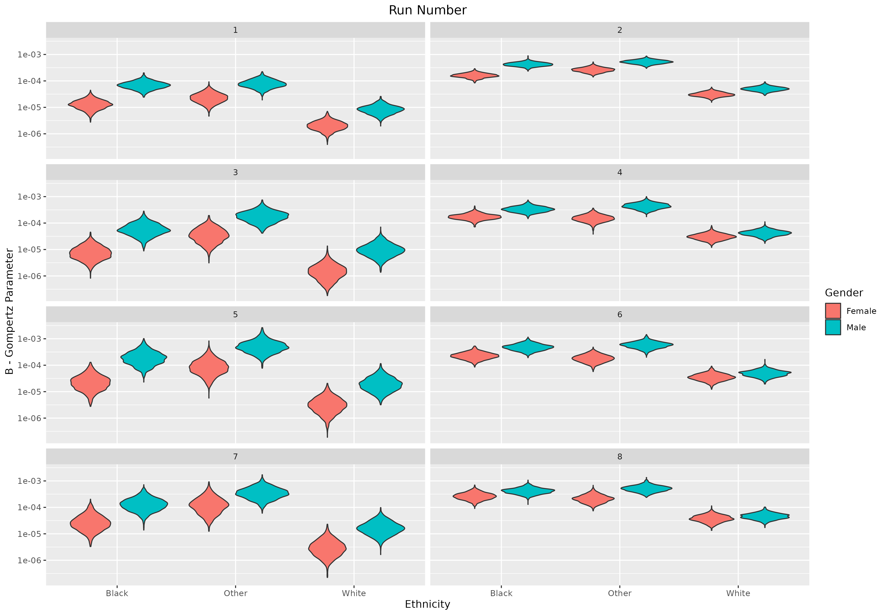
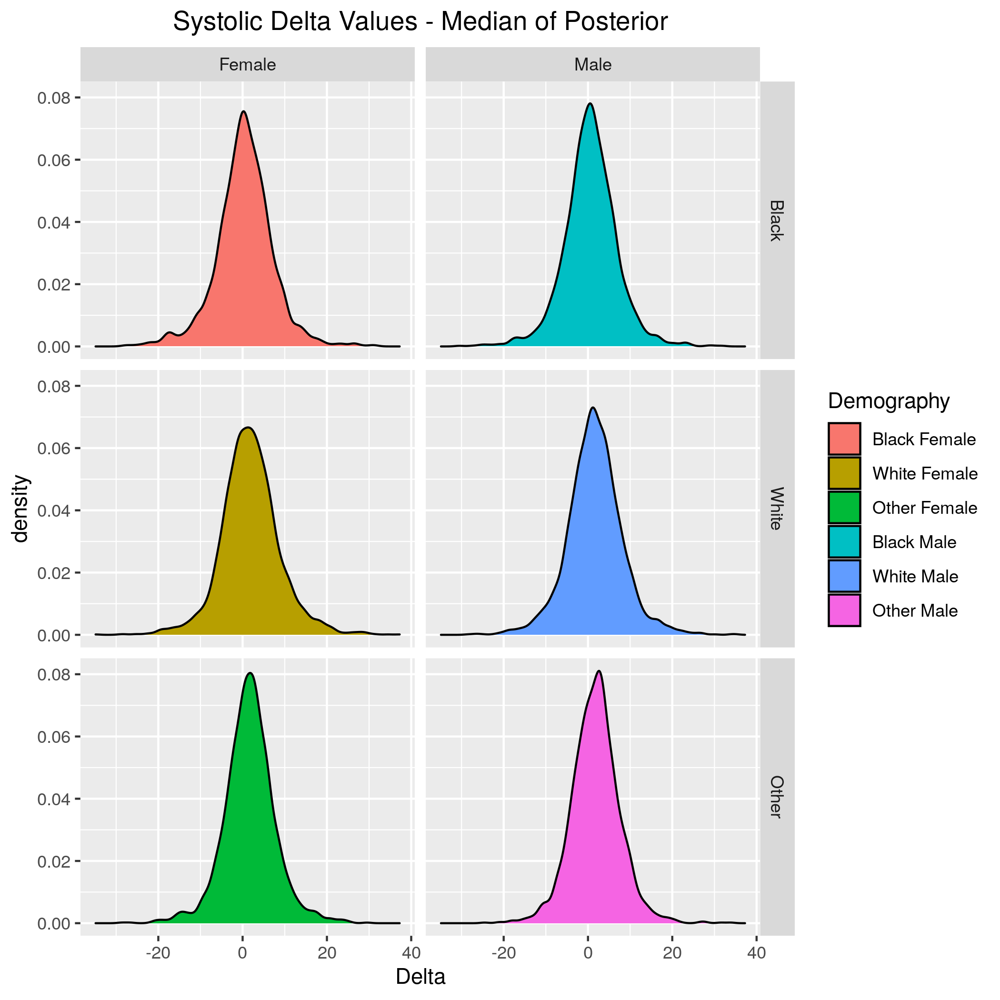
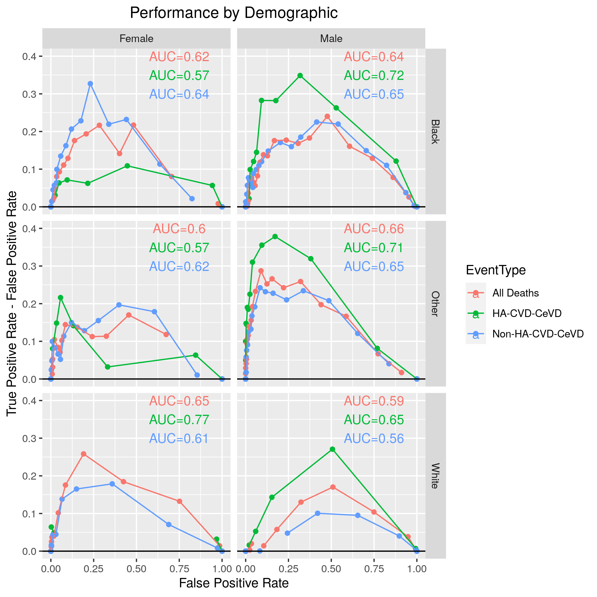
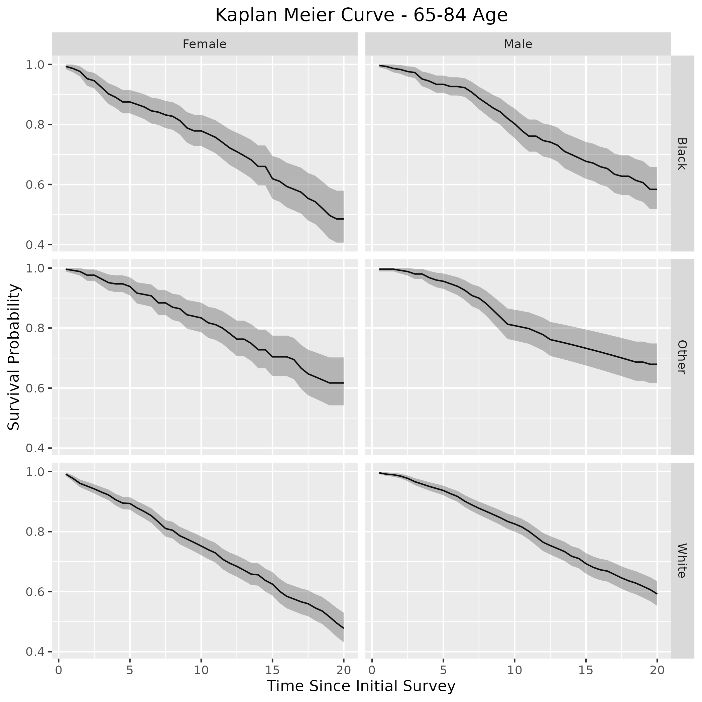
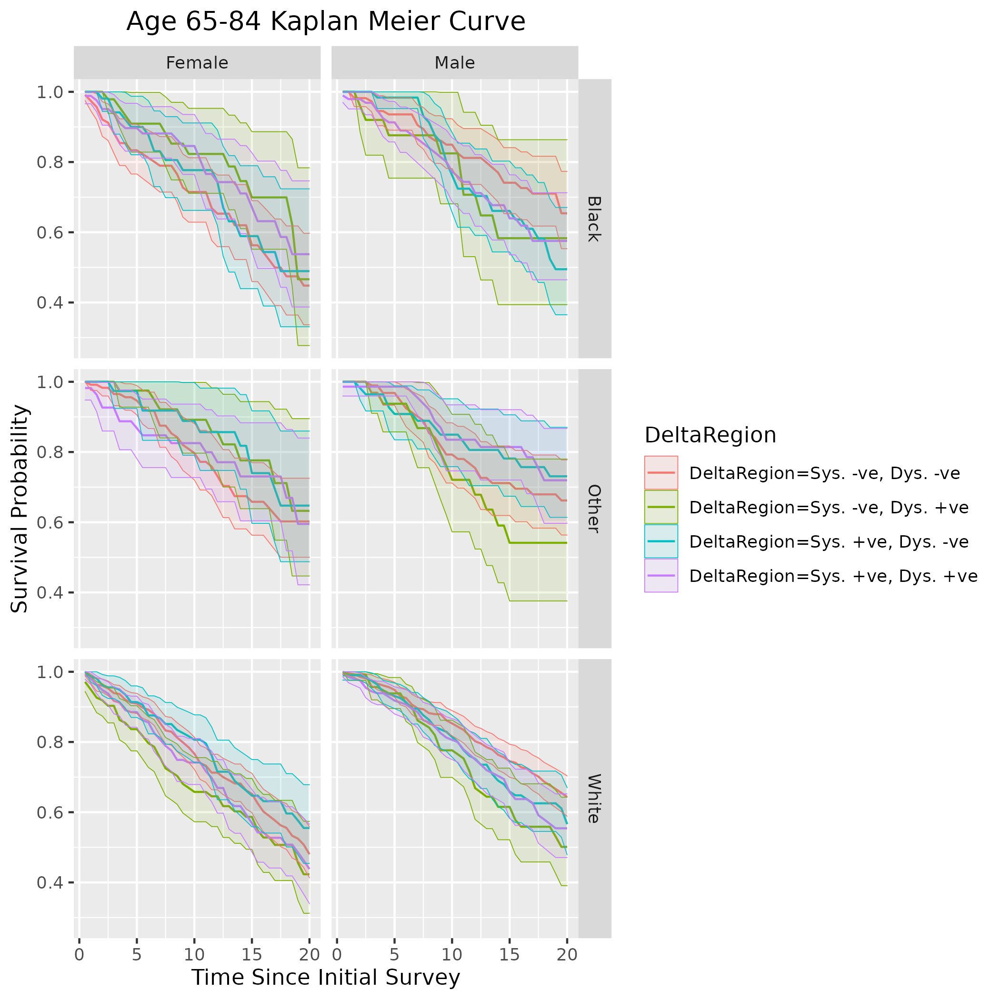

```{r setup, include=FALSE}
knitr::opts_chunk$set(echo = TRUE)
options(tinytex.verbose = TRUE)
library(tidyverse)
library(formatR)
library(magrittr)
library(knitr)
library(tinytex)
library(kableExtra)
```

# Appendix A - Further Detail on Modelling and Results

This appendix aims to add more detail about the numerical modelling than was provided in the article. This is to ensure that the research methods are transparent and entirely reproducible. The numerical modelling presented in this paper was performed using R combined with Rstan. More detail will be provided here about the model, about the specific methodology used to parameterize the model, and more results are provided that were not included in the main bulk of the article.

## Model

The model used in this research is built from the theory of joint modelling of longitudinal and time-to-event data. This will be described in detail later on in this section, however, in brief, this allows the simultaneous modelling of both longitudinal observation data (in this article, this is blood pressure measurements) and also the time-to-event outcome. 
In this research the event of interest is either death from any cause, or death from specifically heart attack, cardiovascular disease (CVD) or cerebrovascular disease (CeVD). We henceforth will refer to this latter mortality as HA-CVD-CeVD.
In the latter case, death from a different cause is treated as a noninformative censoring event.

### Survival Analysis (Time-to-Event)

The basic survival model is a Gompertz hazard rate with proportional hazards influences of the blood pressure covariates. 
The Gompertz equation 
\begin{equation}\label{gompertz}
h_0(t)=B\exp{\left(\theta(x+T)\right)},
\end{equation}
describes the baseline hazard of the population to a particular risk, which, for this article, investigates HA-CVD-CeVD mortality specifically, as well as studying mortality risk in general. $x\in\mathbb{N^N}$ is the age of the individual at the initial interview time, for $N$ the number of individuals, and $T\in\mathbb{R}^{+,N}$ the time since the individual entered the survey. 
Note that both $B$ and $\theta$ have 6 different values, depending on the sex reported at the initial interview -- female or male --- or the race --- black, white or 'other'. 
Note that 'other' in the race category is a combination of all non-black or non-white racial identities, such as Hispanic populations. 
The log-linear proportional hazards model links the covariates of the model (mean systolic blood pressure, variance in the diastolic blood pressure, etc) to the survival outcome of the individual via the equation
\begin{equation}\label{prophaz}
h(t)=h_0(t)\exp{\left(\boldsymbol{\beta}\cdot(\boldsymbol{X}-\hat{\boldsymbol{X}})\right)},
\end{equation}
where $\boldsymbol{X}\in\mathbb{R}^{+,N\times d}$ is a vector of summary statistics of the blood pressure measurements of individual covariates in our model, $\hat{\boldsymbol{X}}\in\mathbb{R}^{+,d}$ is the centering of the covariates such that the equation $\sum_i^N \exp{(\boldsymbol{\beta}\cdot(\boldsymbol{X}-\hat{\boldsymbol{X}}))}=0$ is approximately satisfied (more on this later), and $\boldsymbol{\beta}\in\mathbb{R}^d$ implies the strength of the influence of the covariate on the mortality risk. 
The majority of mortality events are censored --- not yet known at the time of data collection --- the censoring indicator being notated as $\delta\in \{0,1\}$.
When HA-CVD-CeVD mortality is the event being analysed, deaths due to other causes are treated as noninformative censoring events.
In this study, we explored the following covariates:

```{r, include=FALSE}
DF<-data.frame(varnames=c("$FRS-1998$",
                          "$FRS-ATP$",
                          "$M_S$",
                          "$M_D$",
                          "$\\Delta_S$",
                          "$\\Delta_D$",
                          "$\\sigma_{\\{S,H\\}}$",
                          "$\\sigma_{\\{D,H\\}}$",
                          "$\\sigma_{\\{S,C\\}}$",
                          "$\\sigma_{\\{D,C\\}}$",
                          "$\\tau_{\\{S,H\\}}$",
                          "$\\tau_{\\{D,H\\}}$",
                          "$\\tau_{\\{S,C\\}}$",
                          "$\\tau_{\\{D,C\\}}$"),
               support=c("$R^N$",
                         "$R^N$",
                         "$R^{+,N}$",
                         "$R^{+,N}$",
                         "$R^{+,N}$",
                         "$R^{+,N}$",
                         "$R^{+,N}$",
                         "$R^{+,N}$",
                         "$R^{+,N}$",
                         "$R^{+,N}$",
                         "$R^{+,N}$",
                         "$R^{+,N}$",
                         "$R^{+,N}$",
                         "$R^{+,N}$"),
               desc=c("1998 version of the FRS score",
                      "ATP version of the FRS score",
                      "Mean systolic blood pressure",
                      "Mean diastolic blood pressure",
                      "Difference between Home and Clinic mean systolic blood pressure",
                      "Difference between Home and Clinic mean diastolic blood pressure",
                      "Standard deviation of the systolic blood pressure taken at home",
                      "Standard deviation of the diastolic blood pressure taken at home",
                      "Standard deviation of the systolic blood pressure taken at the clinic",
                      "Standard deviation of the diastolic blood pressure taken at the clinic",
                      "Precision of the systolic blood pressure taken at home",
                      "Precision of the diastolic blood pressure taken at home",
                      "Precision of the systolic blood pressure taken at the clinic",
                      "Precision of the diastolic blood pressure taken at the clinic"))

```

```{r, echo=F, label= "runnumers"}
kable(DF,col.names = c("Variable Name", "Support", "Description"),
format="latex", escape = F,booktabs = T)

```

Please note that the last four elements of this list, the precision values, were only carried out to ensure model consistency with the use of standard deviation instead. 
Note as well that the $\Delta$ covariates, representing the medium-term variability, enter into the log relative risk sum as an **absolute value**.

For the parametrization of this model, we assume that the Gompertz parameters and the parameters in the linear predictor term are distributed as follows:
\begin{equation}\label{priorsS}
\begin{aligned}
  \boldsymbol{B}\sim\mathbb{C}(\mu_B,\sigma_B),\\
  \boldsymbol{\theta}\sim\mathfrak{N}(\mu_\theta,\sigma_\theta),\\
  \boldsymbol{\beta}\sim \mathfrak{N}(\mu_\beta,\sigma_\beta),
\end{aligned}
\end{equation}
noting that $\mathbb{C}(\mu,\sigma)$ is the Cauchy distribution. 

The likelihood for this Gompertz proportional hazards model, over all individuals in the census, is as follows:
\begin{equation}\label{likesurv}
L_S(\boldsymbol{v},\boldsymbol{\delta})=\prod_i^N f(v_i,\delta_i|B_i,\theta_i,\beta_i,\boldsymbol{X},\hat{\boldsymbol{X}})=\prod_i^N h(v_i|B_i,\theta_i,\beta_i,\boldsymbol{X},\hat{\boldsymbol{X}})^{\delta_i} \exp{\left( -\sum_i^N H(v_i|B_i,\theta_i,\beta_i,\boldsymbol{X},\hat{\boldsymbol{X}}) \right)},
\end{equation}
with $H(v)=\int_0^v h(w)dw$ the cumulative hazard.

### Longitudinal Modelling

The mortality hazard rates are assumed to be influenced by individual-level blood pressure means and variability characteristics.
These characteristics are not directly observed, but are inferred from their influence on the individual blood pressure measurements, which have been observed.
Let $Y_i(t_j)$ be the observed blood pressure for patient $i$ at time $t_j$, for the individual $i\in 1,2,...,N$ and the number of blood pressure measurements per individual $j\in 1,2,...,k$. Due to the fact that the blood pressure measurement data was taken at both the home and clinic (written using subscripts H and C, respectively), with approximately 6 months between these two measurements, we model the blood pressure using the following model, assuming the diastolic $Y_{i}^D$ and systolic $Y_{i}^S$ blood pressure to be Gaussian-distributed:
\begin{equation}\label{bp}
\begin{aligned}
  (Y_{i}^D)_{H} \sim \mathfrak{N}(M_i^D+\Delta_i^D,(\sigma_i^D)_H),\\
  (Y_{i}^D)_{C} \sim \mathfrak{N}(M_i^D-\Delta_i^D,(\sigma_i^D)_C),\\
  (Y_{i}^S)_{H} \sim \mathfrak{N}(M_i^S+\Delta_i^S,(\sigma_i^S)_H),\\
  (Y_{i}^S)_{C} \sim \mathfrak{N}(M_i^S-\Delta_i^S,(\sigma_i^S)_C),
\end{aligned}
\end{equation}
where superscripts $D$ and $S$ refer to diastolic and systolic blood pressure, respectively. 

The blood pressure characteristics --- the individual-level parameters --- are themselves distributed according to a hierarchical model, determined by population-level parameters (also called ``hyperparameters''):
\begin{equation}\label{priorsL}
\begin{aligned}
  M_i^{\{D,S\}}\sim \mathfrak{N}(\mu_M^{\{D,S\}},\sigma_M^{\{D,S\}}),\\
  \Delta_i^{\{D,S\}}\sim \mathfrak{N}(\mu_D^{\{D,S\}},\sigma_D^{\{D,S\}}),\\
  \sigma_{i,C}^{\{D,S\}}\sim \Gamma(r_C^{\{D,S\}},\lambda_C^{\{D,S\}}),\\
  \sigma_{i,H}^{\{D,S\}}\sim \Gamma(r_H^{\{D,S\}},\lambda_H^{\{D,S\}}).
\end{aligned}
\end{equation}
The longitudinal outcome modelling therefore aims to infer these hyperparameters
\begin{equation}
  \Theta=\left\{\mu_M^{\{D,S\}},\mu_D^{\{D,S\}},\sigma_M^{\{D,S\}},\sigma_D^{\{D,S\}},r_C^{\{D,S\}},\lambda_C^{\{D,S\}},r_H^{\{D,S\}},\lambda_H^{\{D,S\}}\right\},
\end{equation}
and to use the implied uncertainty about the individual-level parameters to inform the inference about the survival parameters.
The likelihood for the longitudinal measurements is therefore (combining the systolic and diastolic into a single parameter for simplicity):
\begin{equation}\label{likelong}
  L_L(\Theta|Y)=\prod_{i=1}^N\left(\prod_{j=1}^{k}f(y_{ij}|M_i,\Delta_i,\sigma_i)\right)f(M_i|\mu_M,\sigma_M)f(\Delta_i|\mu_D,\sigma_D)f(\tau_{i,C}|r_C,\lambda_C)f(\tau_{i,H}|r_H,\lambda_H)
\end{equation}

### Combined Hierarchical Model

Combining the longitudinal outcome and time-to-event partial likelihoods, and for a given parameter space value of $\Omega=\{\beta,B,\theta\}\cup \Theta$, the joint likelihood is
\begin{equation}
\begin{split}
  L(\Omega|Y)=\prod_{i=1}^N\left(\prod_{j=1}^{k}f(y_{ij}|M_i,\Delta_i,\sigma_i)\right)f&(v_i,\delta_i|B_i,\theta_i,\beta_i,\boldsymbol{X},\hat{\boldsymbol{X}})f(M_i|\mu_M,\sigma_M)\\
  &f(\Delta_i|\mu_D,\sigma_D)f(\tau_{i,C}|r_C,\lambda_C)f(\tau_{i,H}|r_H,\lambda_H).
  \end{split}
\end{equation}
One approach to estimating the complete set of hyperparameters
\begin{equation}
  \Omega_H=\{\mu_B,\sigma_B,\mu_\theta,\sigma_\theta,\mu_\beta,\sigma_\beta,\mu_M^{\{D,S\}},\sigma_M^{\{D,S\}},\mu_D^{\{D,S\}},\sigma_D^{\{D,S\}},r_C^{\{D,S\}},\lambda_C^{\{D,S\}},r_H^{\{D,S\}},\lambda_H^{\{D,S\}}\}
\end{equation}
is to impose a higher-level prior distribution, and use the machinery of Bayesian inference to produce posteriors for everything.
This approach runs into computational difficulties, which have led us to a two-stage ``empirical Bayes'' approach, where the hyperparameters for the longitudinal model are first fixed by a maximum-likelihood calculation, after which the remaining hyperparameters and individual-level parameters can be estimated with Bayesian machinery. 
For the time-to-event parameters we choose flat hyperpriors, selecting the hyperparameters $\mu_B=\mu_\theta=\mu_\beta=0$,  $\sigma_B=\sigma_\theta=2$, and $\sigma_\beta=100$.

### The modelling variants

In this article, we researched into 16 variants of the model-fitting problem, but focussed mainly on 8 of them. 
The 8 main models use the standard deviation, $\sigma$, as the measure of the influence of blood-pressure variability on mortality. 
We also produced the same 8 models but using precision, $\tau=1/\sigma^2$, as the measure of the influence of blood-pressure variability on mortality. 
However, this was only to ensure that there were no differences between the use of one over the other. 
Throughout the remainder of this appendix, we refer to the 8 main models using the following run numbers:

\begin{enumerate}
\item All participants (15,295), using mean systolic and diastolic blood pressure (not FRS) in the linear predictor term, with the outcome data as death specifically from HA-CVD-CeVD.
\item All participants (15,295), using mean systolic and diastolic blood pressure (not FRS) in the linear predictor term, with the outcome data as all-causes of death.
\item Only participants that had data from which FRS values could be computed (N=9,418) --- the ``FRS population'' but using mean systolic and diastolic blood pressure (not FRS) in the linear predictor term, with the outcome data as death specifically from HA-CVD-CeVD.
\item FRS population, but using mean systolic and diastolic blood pressure (not FRS) in the linear predictor term, with the outcome data as all-causes of death.
\item FRS population, and using the FRS ATP-III value in the linear predictor term, with the outcome data as death specifically from HA-CVD-CeVD.
\item FRS population, and using the FRS ATP-III value in the linear predictor term, with the outcome data as all-causes of death.
\item FRS population, and using the FRS 1998-version value in the linear predictor term, with the outcome data as death specifically from HA-CVD-CeVD.
\item FRS population, and using the FRS 1998-version value in the linear predictor term, with the outcome data as all-causes of death.
\label{tab:runnums}
\end{enumerate}

We also include Directed Acyclical Graph (DAG) sketches to help visualize the different models, as shown in figures \ref{fig:DAGmean} and \ref{fig:DAGFRS}. 
In order to read the DAGs, note that each square background layer that appears as a stack of layers represents different measured outcomes that were made in the first wave of the survey. 
The outcome variables measured are represented by a square-shaped text box, and a parameter of the model is represented by a circular-shaped text box. If either a square or circular text box is placed on top of a stacked rectangular layer, it means that multiple values of that variable (as many as there are layers to the stack) are either measured (for outcome variables) or simulated (for parameters of the model). Please note that the number of layers in the stack is written in the text box that does not contain a frame which is intentionally displayed on top of the stacked layer that it represents. For example, $i=1,...,N$. 
Finally, the direction of the arrows implies causality assumed in the model.

{#fig:DAGmean}

{#fig:DAGFRS}

For convenience, we provide an overview of the different blood pressure values in the full and FRS populations in tables \ref{tab:BloodFull} and \ref{tab:BloodFRS}.


```{r BloodFull,echo=F}
Blood<-read_csv("./Results/BloodVals.csv",show_col_types = FALSE)
kable(Blood[Blood$Population=="Full",-1],
format="latex", escape = F,booktabs = T, caption = "Parameters for distribution of blood pressure, for the full population")
```


```{r BloodFRS,echo=F}
Blood<-read_csv("./Results/BloodVals.csv",show_col_types = FALSE)
kable(Blood[Blood$Population=="FRS",-1],
format="latex", escape = F,booktabs = T, caption = "Parameters for distribution of blood pressure, for the FRS population")
```


## Methodology

The methodology for this research can be split into three main sections: 1) calculating the empirical Bayes' parameters, 2) parameterizing the model using Hamiltonian Monte Carlo (HMC) and 3) re-centering the variables in the linear predictor equation. By applying empirical Bayes', Maximum Likelihood Estimates (MLEs) of some of the parameter distributions are provided. Note that the parameters estimated here are only the prior distribution of the global (not individual) blood pressure means and the variances, for both systolic and diastolic and home and clinic measurements. These estimates are then provided as prior distributions for the Stan MCMC simulations using HMC, where estimates can be made for all the parameter distributions of the model, given the specific centering applied. Finally, section (3) recalculates the centering values based on the previous MCMC iteration, and sets of the next iteration, while simultaneously checking for convergence in both the MCMC simulations and the centering values.

### Empirical Bayes Parameters

## Extract intervals for the digits
Suppose the fractions of digits 0,2,4,6,8 are $b_0,b_2,b_4,b_6,b_8$.
Letting $B_0=0$ and $B_k=10\sum_{j=0}^{k-1}b_{2j}$ for $k=1,\dots,5$,
we want to choose a positive $a$ and place breaks at $-a+B_k$, so that measurements between $-a+B_k$ and $-a+B_{k+1}$ modulo
10 are assigned the final digit $2k$, for $k=0,\dots,4$.
We choose $a$ to minimise the total distance of the intervals from the rounded value:
$$
  \sum_{k=0}^4 \int_{-a+B_k}^{-a+B_{k+1}} \bigl| x-2k\bigr|\mathrm{d} x=\frac12\sum_{k=0}^4 \left(-a+B_k-2k\right)^2 + \left(-a+B_{k+1}-2k\right)^2,
$$
as long as $2k$ is in the appropriate interval. This is minimized at
$$
  a= \frac{1}{5}\left(B_1+B_2+B_3+B_4 - 15\right)=\sum_{j=0}^3 (8-2j) b_{2j} \, - 3.
$$

```{r load_data, include=FALSE}
w<-getwd()
L1 <- './Data_cleaned/nhanesA.RData'
L2 <- './Data_cleaned/nhanes_cleaned_lists.RData'
S1 <- "./Model/BP_parameters.RData"
load(L1)
load(L2)
load(S1)
```
```{r process, include=FALSE}
N=dim(nhanesA)[1]
k=3
BP_type_names <- c('Systolic','Diastolic')
BP_place_names <- c('Home','Clinic')
whichsys=match(c('systolicA','systolicB','systolicC'),names(nhanesA))
whichdias=match(c('diastolicA','diastolicB','diastolicC'),names(nhanesA)) 

whichsyshome=match(c('systolicAhome','systolicBhome','systolicChome'),names(nhanesA))
whichdiashome=match(c('diastolicAhome','diastolicBhome','diastolicChome'),names(nhanesA))
whichBP=c(whichsys,whichdias)
whichBPhome=c(whichsyshome,whichdiashome)
# allsys=c(whichsys,whichsyshome)
# alldias=c(whichdias,whichdiashome)

# Make BP measures into array
sys=data.matrix(nhanesA[,whichsys])
dias=data.matrix(nhanesA[,whichdias])
sysH=data.matrix(nhanesA[,whichsyshome])
diasH=data.matrix(nhanesA[,whichdiashome])
L=length(sys)
gamma_dimnames <- list( c('alpha','theta','beta') , c('Clinic' , 'Home'))
norm_dimnames <- c('m_M','m_Delta', 'sigma2_M', 'sigma2_Delta')
```
```{r imputation, eval=TRUE, tidy=TRUE,include=FALSE}
digitbreaks <- function(bp){
  digit_table <- unname(table(unlist(bp)%%10))
  digits=digit_table/sum(digit_table)
  a <- sum(seq(8,0,by = -2)*digits) - 3 # Find the starting point for the first interval that minimises
  list(BP=bp,digit.breaks=c(0,cumsum(digits[-5]))*10-a)
}

# Combine the measures into a list, so they can be processed uniformly
#   First level, Systolic or Diastolic
#   Second level, Home or Clinic
#  Third level, BP and breaks
allBP <- list(Systolic=list(Clinic=digitbreaks(sys),Home=digitbreaks(sysH)),Diastolic=list(Clinic=digitbreaks(dias),Home=digitbreaks(diasH)))

  # Shift by the mean of the cumulative sums; apply transposes, so we transpose back

### Impute fractional parts. 

impute <- function(d, breaks=c(1,3,5,7,9)){
  # Intervals defined relative to the centre
  right_breaks <- breaks-seq(0,8,by=2)
    left_breaks <- c(breaks[5]-10,breaks[1:4]-seq(2,8,by=2))
  if (!all(d%%2==0)){stop('Not all even digits')}
  else{
    if (is.null(dim(d))){ # Not an array
      d2 <- (d%%10)/2+1
      runif(length(d2))*(right_breaks[d2]-left_breaks[d2])+left_breaks[d2]+d
    }
    else{
      apply(d,2,function(dd) impute(dd,breaks))
    }
  }
}

# Input is a list BP=matrix of measures, digit.breaks=break points
imputeBP <- function(bp_with_breaks){
  breaks <- bp_with_breaks$digit.breaks
  d <- bp_with_breaks$BP
  list(BP=impute(d,breaks),digit.breaks=breaks)
}

allBP_imp <- lapply(allBP, function(BPtype) lapply(BPtype,function(BPplace) imputeBP(BPplace)))
```
## Fit the BP distribution parameters
We suppose that each individual has BP measures
$\tilde{y}_{ij}^l$ for $i=1,\dots,n$, $j=1,\dots,k$ (default $k=3$),
and $l=1,2$, which are rounded versions of 
$$
  y_{ij}^l \sim \mathcal{N}\bigl( \mu_i^l,(\tau_i^l)^{-1}\bigr),
$$
where 
\begin{align*}
\mu_i^1&=(M_i+\Delta_i)/2,\\
\mu_i^2&=(M_i-\Delta_i)/2,\\
M_i&\sim \mathcal{N}\bigl(m_M,\sigma^2_M) \text{ and }
  \Delta_i\sim \mathcal{N}\bigl(m_\Delta,\sigma^2_\Delta) \text{ independent,}\\
  \tau_i^l &\sim \mathrm{Gamma}(\alpha^l,\alpha^l/\theta^l ).
\end{align*}
(Note that $\alpha^l$ is the usual shape parameter,
while $\theta^l$ is the expectation.)

We wish to estimate the eight parameters 
$$
(m_M,m_\Delta,\sigma^2_M,\sigma^2_\Delta,\alpha^1,\theta^1,\alpha^2,\theta^2)
$$
We begin by assuming $y_{ij}^l$ observed directly. We estimate
by maximising the partial likelihood on the observations
\begin{align*}
  \bar{y}_{i+}&:= \frac{1}{2k} \sum_{j=1}^k y_{ij}^1 + y_{ij}^2,\\
  \bar{y}_{i-}&:= \frac{1}{2k} \sum_{j=1}^k y_{ij}^1 - y_{ij}^2,\\
  s_i^l&:=  \frac{1}{k-1}\sum_{j=1}^k \Bigl( y_{ij}^l - \frac{1}{k} \sum_{j=1}^k y_{ij}^l \Bigr)^2.
\end{align*}
Note that 
$$
(k-1)s_i^l \tau_i^l =\sum_{j=1}^k \Bigl( z_{ij}^l - \frac{1}{k} \sum_{j=1}^k z_{ij}^l \Bigr)^2.
$$ 
where $z_{ij}^l$ are i.i.d.\ standard normal
is independent of $\tau_i^l$, thus has a chi-squared distribution
with $k-1$ degrees of freedom --- hence $\frac{k-1}{2}\cdot s_i^l\tau_i^l$ is
gamma distributed with parameters $(\frac{k-1}{2},1)$. Since $\frac{\alpha}{\theta}\tau_i^l$ is independent of $s_i^l\tau_i^l$, with $\mathrm{Gamma}(\alpha,1)$ distribution, we see that $\frac{\theta(k-1)}{2\alpha}s_i^l$ is the ratio of two independent gamma random variables, hence has beta-prime distribution with parameters $\left(\frac{k-1}{2}, \alpha \right)$, so log partial likelihood
$$
  \ell_{\operatorname{Beta}}(\alpha,\theta;s^l_\cdot)=n\alpha \log\frac{\alpha}{\theta}+n\log\Gamma\left(\alpha+\frac{k-1}{2}\right)-n\log\Gamma(\alpha)
  + \frac{k-1}{2} \sum_{i=1}^n \log s_i^l -\left(\alpha+\frac{k-1}{2}\right) \sum_{i=1}^n \log \left(s_i^l+\frac\alpha\theta\right).
$$
Note as well that these quantities $(k-1)s_i^l$ should correspond to empirically observed individual variances; hence we will compare these empirical variances (with imputed fractional parts) divided by the normalization factor $2\alpha/(k-1)\theta$ to the beta-prime distribution below as a goodness-of-fit test.

The partial Fisher Information has entries
\begin{align*}
 -\frac{\partial^2 \ell}{\partial \alpha^2} &=
   n\psi_1\left(\alpha\right) - n\psi_1\left(\alpha+\frac{k-1}{2}\right)
  - \frac{n}{\alpha} +\sum_{i=1}^n \frac{2\theta s_i^l + \alpha-(k-1)/2}{(\theta s_i^l + \alpha)^2}\\
-\frac{\partial^2 \ell}{\partial \theta^2} &=
   -\frac{n \alpha}{\theta^2} +\frac{\alpha}{\theta^2}\left(\alpha+\frac{k-1}{2}\right)\sum_{i=1}^n \frac{2\theta s_i^l + \alpha}{(\theta s_i^l + \alpha)^2}\\
-\frac{\partial^2 \ell}{\partial \theta\partial\alpha} &= \frac{n}{\theta}-
   \frac1\theta \sum_{i=1}^n \frac{\alpha^2+2\alpha\theta s_i^l+\frac{k-1}{2}\theta s_i^l}{(\theta s_i^l + \alpha)^2}.
\end{align*}
where $\psi_1$ is the trigamma function.
```{r log_likelihoods, tidy=TRUE, echo=FALSE}
  beta_prime_LL=function(alpha,theta,s,k=3){
    k1= (k-1)/2
    n<- length(s)
    alpha * n * log( alpha / theta ) - n * lbeta(k1 , alpha )+ (k1-1)* sum(log(s)) -
      (alpha + k1 )*sum(log(s+alpha/theta))
  }

beta_prime_gradient= function(alpha,theta,s,k=3){
  n<- length(s)
  k1 <- (k-1)/2
  d_a <- -n*log(alpha/theta)  - n*digamma(alpha) + n*digamma(alpha+ k1 ) - (alpha+ k1) * sum(log(s * theta -k1)/(s*theta+alpha))
  d_t <- -n*alpha/theta + (alpha+ k1 ) * alpha/theta * sum( 1 /(theta*s+ alpha))
  c(d_a,d_t)
}

# Fisher Information
beta_prime_FI=function(alpha,theta,s,k=3){
    n<- length(s)
    k1 <- (k-1)/2
    d_aa <- -n/alpha + sum(( 2*theta*s+alpha - k1 )/(theta*s+alpha)^2) -
      n*trigamma(alpha+k1 ) + n * trigamma(alpha)
    d_tt <- -n* alpha /theta^2 + ( alpha + k1 )*alpha/theta^2 * sum((alpha+2*theta*s)/
                                           (theta*s+alpha)^2) 
    d_at <- sum((s^2*theta - s*k1) / (alpha+ theta*s)^2)
    matrix(c(d_aa,d_at,d_at,d_tt), 2, 2)
}

alphatheta <- function(BP){
  k <- dim(BP)[2]
  s <- (k-1)/2*apply(BP,1,var)
  LL <- function(gamma_params){
    -beta_prime_LL(gamma_params[1],gamma_params[2],s,k)
  }
  LL_grad <- function(gamma_params){
    -beta_prime_gradient(gamma_params[1],gamma_params[2],s,k)
  }
  # Using optim because constrOptim doesn't work
  #fit <- suppressWarnings( constrOptim(c(1,1),f = LL, grad = LL_grad, ui = diag(1,nrow = 2,ncol = 2), ci = c(0,0)) ) # Constraint matrix identity, so constrained >0
  fit <- suppressWarnings( optim(par = c(1,1),fn = LL, gr = LL_grad ) )
  fisher_info <- beta_prime_FI(fit$par[1],fit$par[2],s,k)
  list( alpha = fit$par[1], theta = fit$par[2], variance = solve(fisher_info), LogLikelihood = -fit$value)
}
```
Let $(\hat\alpha^l,\hat\beta^l)$ be the maximum partial likelihood estimators. Conditioned on $(\tau_i^l)$ we have
\begin{align*}
  \bar{y}_{i+}&\sim \mathcal{N}\left(m_M, \sigma^2_M + \frac{1}{4k}\left( \frac{1}{\tau_i^1}+\frac{1}{\tau_i^2}\right)\right),\\
  \bar{y}_{i-}&\sim \mathcal{N}\left(m_\Delta,\sigma^2_\Delta + \frac{1}{4k}\left( \frac{1}{\tau_i^1}+\frac{1}{\tau_i^2}\right)\right).
\end{align*}
We would then have MLEs
\begin{align*}
  \hat{m}_M&= \frac{1}{n} \sum_{i=1}^n \bar{y}_{i+},\\
  \hat{m}_\Delta&= \frac{1}{n} \sum_{i=1}^n \bar{y}_{i-},
\end{align*}
which are approximately normally distributed, with means $m_M$ and $m_\Delta$ respectively, and conditional on $\tau_i^l$ standard errors
$$
  \frac{\sigma_M^2}{n}+\frac{1}{4kn^2} \sum_{i=1}^n (\tau_i^1)^{-1} + (\tau_i^2)^{-1} \quad \text{ and } \quad
  \frac{\sigma_\Delta^2}{n}+\frac{1}{4kn^2} \sum_{i=1}^n (\tau_i^1)^{-1} + (\tau_i^2)^{-1},
$$
which we may approximate --- with error on the order of $n^{-3/2}$ --- replaceing the mean of $(\tau_i^l)^{-1}$ by its expected value $\beta^l/(\alpha^l-1)$ to obtain
\begin{align*}
  \mathrm{Var}(\hat{m}_M) &\approx \frac{\sigma_M^2}{n}+\frac{1}{4kn}\left( \frac{\beta^1}{\alpha^1-1}+ \frac{\beta^2}{\alpha^2-1}\right) \\
  \mathrm{Var}(\hat{m}_\Delta) &\approx \frac{\sigma_\Delta^2}{n}+\frac{1}{4kn}\left( \frac{\beta^1}{\alpha^1-1}+ \frac{\beta^2}{\alpha^2-1}\right) 
\end{align*}
Finally, conditioned on the $\tau_i^l$ we have that the random variables $\bar{y}_{i+}$ are normal with variance
$$
  \sigma_M^2+\frac{1}{4k}\left((\tau_i^1)^{-1} + (\tau_i^1)^{-1} \right),
$$
so the unconditional variance is the expected value, or
$$
  \sigma_M^2+\frac{1}{4k}\left(\frac{\beta^1}{\alpha^1-1}+ \frac{\beta^2}{\alpha^2-1} \right).
$$
This yields the estimators
\begin{align*}
  \hat\sigma_M^2 &=\frac{1}{n-1}\sum_{i=1}^n\left(\bar{y}_{i+}-n^{-1}\sum_{i=1}^n y_{i+}\right)^2 - \frac{1}{4k}\left(\frac{\hat\beta^1}{\hat\alpha^1-1}+ \frac{\hat\beta^2}{\hat\alpha^2-1} \right),\\
  \hat\sigma_\Delta^2 &=\frac{1}{n-1}\sum_{i=1}^n\left(\bar{y}_{i-}-n^{-1}\sum_{i=1}^n y_{i-}\right)^2 - \frac{1}{4k}\left(\frac{\hat\beta^1}{\hat\alpha^1-1}+ \frac{\hat\beta^2}{\hat\alpha^2-1} \right).
\end{align*}
Using the delta method, and the fact that  we see that the variance of $\hat\beta/(\hat\alpha-1)$ is approximately
$$
  \frac{\sigma_\beta^2}{(\hat\alpha-1)^2} + \frac{\hat\beta^2\sigma_\alpha^2}{(\hat\alpha-1)^4},
$$
where $\sigma_\alpha$ and $\sigma_\beta$ are the standard errors for $\hat\alpha$ and $\hat\beta$ respectively, so the standard errors for $\hat\sigma_M^2$ and $\hat\sigma_\Delta^2$ are approximately
\begin{align*}
  \operatorname{SE}\left(\hat\sigma_M^2\right)&\approx \frac{1}{2k}\Bigl(\frac{8k^2\hat\sigma_M^2}{n} + \frac{\sigma_\beta^2}{(\hat\alpha^1-1)^2} + \frac{(\hat\beta^1)^2\sigma_\alpha^2}{(\hat\alpha^1-1)^4} + \frac{\sigma_\beta^2}{(\hat\alpha^2-1)^2} + \frac{(\hat\beta^2)^2\sigma_\alpha^2}{(\hat\alpha^2-1)^4} \Bigr)^{1/2},\\
  \operatorname{SE}\left(\hat\sigma_\Delta^2\right)&\approx \frac{1}{2k}\Bigl(\frac{8k^2\hat\sigma_\Delta^2}{n} + \frac{\sigma_\beta^2}{(\hat\alpha^1-1)^2} + \frac{(\hat\beta^1)^2\sigma_\alpha^2}{(\hat\alpha^1-1)^4} + \frac{\sigma_\beta^2}{(\hat\alpha^2-1)^2} + \frac{(\hat\beta^2)^2\sigma_\alpha^2}{(\hat\alpha^2-1)^4} \Bigr)^{1/2}
\end{align*}
```{r parameter_fitting, tidy=TRUE, cache=TRUE,echo=FALSE, eval=TRUE,include=FALSE}
# Input a pair of BP lists (clinical and home), and output 8 parameters, with variances for each
all_BP_parameters <- function(measures){
  stopifnot(setequal(names(measures) , c('Clinic','Home')),all.equal(dim(measures$Clinic),dim(measures$Home)))
  k <- dim(measures$Clinic$BP)[2]
  n <- dim(measures$Clinic$BP)[1]
  s <- lapply(measures,function(m) (k-1)/2*apply(m$BP,1,var))
  ybar <- vapply(measures,function(m) apply(m$BP,1,mean),FUN.VALUE = rep(0,n))
  ybar_plus <- (ybar[,'Home']+ybar[,'Clinic'])/2
  ybar_minus <- (ybar[,'Home']-ybar[,'Clinic'])/2
  m_M <- mean(ybar_plus)
  m_Delta <- mean(ybar_minus)
  gamma_fits <- lapply(measures,function(m) alphatheta(m$BP))
  variance_correction <- sum(sapply(gamma_fits,function(GF) GF$alpha/GF$theta/(GF$alpha - 1)))/4/k
  vv_correction <- sum(sapply(gamma_fits,function(GF) diag(GF$variance)*c(GF$alpha^2/GF$theta^2/(GF$alpha-1)^4,1/(GF$alpha-1)^2))) # correction to the variance of the variance
  sigma2_M <- var(ybar_plus) - variance_correction
  sigma2_Delta <- var(ybar_minus) - variance_correction
  list(Gamma=gamma_fits,Normal=list(M=list(m=m_M,m.std.error=sd(ybar_plus)/sqrt(n),sigma2 = sigma2_M, sigma2.std.error = sqrt(8*k*k*sigma2_M/n+vv_correction)),Delta=list(m=m_Delta,m.std.error=sd(ybar_minus)/sqrt(n),sigma2 = sigma2_Delta, sigma2.std.error = sqrt(8*k*k*sigma2_Delta/n+vv_correction))))
}

# Apply separately to Systolic and Diastolic
BP_parameters <- lapply(allBP_imp,function(bp) all_BP_parameters(bp))
save(BP_parameters, file = 'BP_parameters.RData')

## Define functions to convert parameters between the format where 
##   Sys and Dias are the top level, and where normal and gamma are separate
##   convert_param1 takes list (systolic, diastolic), outputs list (normal,gamma)
##   convert_param2 does the opposite
convert_param1 <- function(all_params){
  norm_params <- lapply(all_params, function(params) {
    with(params$Normal, c(m_M = M$m , m_Delta = Delta$m, sigma2_M = M$sigma2, sigma2_Delta = Delta$sigma2))
  })
  gamma_params <- lapply(all_params, function(params) {
    GP <- array( 0, dim = c(3,2) , dimnames = gamma_dimnames)
  GP[ 'alpha', ] <- c(params$Gamma$Clinic$alpha, params$Gamma$Home$alpha)
  GP[ 'theta', ] <- c(params$Gamma$Clinic$theta, params$Gamma$Home$theta)
  GP[ 'beta', ] <- GP[ 'alpha', ] / GP[ 'theta', ]
  GP
  })
  list(Normal = norm_params, Gamma = gamma_params )
}
```

<!-- ## Test whether parameters are being fit correctly -->
<!-- We simulate bootstrap data sets, find the average parameter estimate, and compare to the "true" parameters. -->
<!-- We also compare the average estimated SE to the "true" SE (which is the SD of the estimates). -->
```{r test_parameters, eval=TRUE, echo=FALSE, cache = TRUE, results= 'asis',include=FALSE}
k <- 3
num_reps <- 100

BP_simulation <- function(norm_params,gamma_params,num_indiv, num_sim=1,k=3){
  # norm_params is a vector with named entries 'm_M','m_Delta','sigma_M','sigma_Delta',
  # gamma_params is a matrix with rows 'alpha' and 'beta', columns 'Home" and 'Clinic"
  # n is number of simulations
   stopifnot(all(is.element(c('alpha','beta'),dimnames(gamma_params)[[1]])),
              all(is.element(c('Clinic','Home'),dimnames(gamma_params)[[2]])),
              setequal(names(norm_params),norm_dimnames)
    )
  lapply(seq_len(num_sim),function(i){
    M <- rnorm(num_indiv,mean = norm_params['m_M'],sd = sqrt(norm_params['sigma2_M']))
    Delta <- rnorm(num_indiv,mean = norm_params['m_Delta'], sd = sqrt(norm_params['sigma2_Delta']))
    muH <- (M+Delta)
    muC <- (M-Delta)
    tauH <- rgamma(num_indiv,shape = gamma_params['alpha','Home'], rate = gamma_params['beta','Home'])
    tauC <- rgamma(num_indiv,shape = gamma_params['alpha','Clinic'], rate = gamma_params['beta','Clinic'])
    all_individual_params=cbind(mu.Home = muH, mu.Clinic = muC, sigma.Home = tauH^(-.5), sigma.Clinic = tauC^(-.5))
    list(Home = list(BP = t(apply(all_individual_params, 1, function(pars) rnorm(k,pars['mu.Home'],pars['sigma.Home'])))),
             Clinic = list(BP= t(apply(all_individual_params, 1, function(pars) rnorm(k,pars['mu.Clinic'],pars['sigma.Clinic'])))))
  })
}

# Simulation that inputs two sets of parameters, and outputs pairs (systolic, diastolic)
BP_simulation2 <- function(norm_params,gamma_params, num_indiv, num_sim=1,k=3){
  stopifnot(setequal(names(norm_params) , BP_type_names), 
            setequal(names(gamma_params) , BP_type_names))
  bp <- lapply(BP_type_names, function(BPtype) BP_simulation(norm_params[[BPtype]],gamma_params[[BPtype]],num_indiv, num_sim,k))
  names(bp) <- BP_type_names
  lapply(seq_len(num_sim),function(i) lapply(BP_type_names, function(BP_type) bp[[BP_type]][[i]]) %>% 
           setNames(BP_type_names))
}

round_bp <- function(bp,rounding_boundaries=c(-1, 1,3,5,7), real_digits=c(0,2,4,6,8)){
  stopifnot(length(rounding_boundaries)==length(real_digits))
  if (is.array(bp)){apply(bp,2,round_bp)}
  else{
    bp_shifted <- bp - rounding_boundaries[1] # Shift the lowest boundary up to 0
    bp_int <- bp_shifted %% 10
    bp10 <- bp_shifted - bp_int
    sapply(seq_along(bp),function(i) {
      real_digits[sum(bp_int[i]>= (rounding_boundaries-rounding_boundaries[1]) ) ]} ) +bp10
  }
}

# First simulate BPs, then round, according to a different set of boundaries for each place
BP_simulation_rounded <- function(norm_params,gamma_params,num_indiv, num_sim=1,
                                  k=3,rounding_boundaries=list(Home=c(-1, 1,3,5,7), Clinic= c(-1,1, 3, 5,7)),
                                  real_digits=c(0,2,4,6,8)){
  bp <- BP_simulation(norm_params,gamma_params,num_indiv, num_sim,k)
  lapply(bp,function(simulated_dataset) lapply(BP_place_names, function(BPplace) list(BP=round_bp(simulated_dataset[[BPplace]]$BP,rounding_boundaries[[BPplace]], real_digits),digit.breaks=rounding_boundaries[[BPplace]])) %>%
           setNames(BP_place_names)
         )
}

BP_simulation2_rounded <- function(norm_params,gamma_params, num_indiv,
                                   num_sim=1,k=3, rounding_boundaries=list(Home=c(-1, 1,3,5,7), Clinic= c(-1,1, 3, 5,7)),
                                  real_digits=c(0,2,4,6,8)){
  stopifnot(setequal(names(norm_params) , BP_type_names), 
            setequal(names(gamma_params) , BP_type_names))
  bp <- lapply(BP_type_names, function(BPtype) BP_simulation_rounded(norm_params[[BPtype]],gamma_params[[BPtype]],num_indiv, num_sim,k,rounding_boundaries, real_digits)) %>%
    setNames(BP_type_names)
  lapply(seq_len(num_sim),function(i) lapply(BP_type_names, function(BPtype) bp[[BPtype]][[i]])) %>% setNames(BP_type_names)
}

num_reps <- 100
params <- convert_param1(BP_parameters)
#b= BP_simulation2(norm_params , gamma_params2,num_indiv = N,num_sim = num_reps)


for(which_bp in BP_type_names){
  estimates <- array(0,dim = c(num_reps,8),dimnames = list( NULL , c(norm_dimnames,'alpha_C','theta_C','alpha_H','theta_H')))
  std_errors <- array(0,dim = c(num_reps,8),dimnames = list( NULL , c(norm_dimnames,'alpha_C','theta_C','alpha_H','theta_H')))

  bp <- BP_simulation(params$Normal[[which_bp]],params$Gamma[[which_bp]], num_indiv=N, num_reps)
simulation_params <- lapply(bp, function(bp_sim) all_BP_parameters(bp_sim)) # simulated parameter estimates

for(i in seq_len(num_reps)){
  spe <- simulation_params[[i]]
  estimates[i,'m_M'] <- spe$Normal$M$m
  estimates[i,'m_Delta'] <- spe$Normal$Delta$m
  estimates[i,'sigma2_M'] <- spe$Normal$M$sigma2
  estimates[i,'sigma2_Delta'] <- spe$Normal$Delta$sigma2
  std_errors[i,'m_M'] <- spe$Normal$M$m.std.error
  std_errors[i,'m_Delta'] <- spe$Normal$Delta$m.std.error
  std_errors[i,'sigma2_M'] <- spe$Normal$M$sigma2.std.error
  std_errors[i,'sigma2_Delta'] <- spe$Normal$Delta$sigma2.std.error
  estimates[i, 'alpha_C'] <- spe$Gamma$Clinic$alpha
  estimates[i, 'theta_C'] <- spe$Gamma$Clinic$theta
  estimates[i, 'alpha_H'] <- spe$Gamma$Home$alpha
  estimates[i, 'theta_H'] <- spe$Gamma$Home$theta
  std_errors[i, c('alpha_C','theta_C')] <- sqrt(diag(spe$Gamma$Clinic$variance))
  std_errors[i, c('alpha_H','theta_H')] <- sqrt(diag(spe$Gamma$Home$variance))
}

simulation_mean_estimate <- apply(estimates,2,mean)
simulation_mean_SE <- apply(std_errors,2, mean )
simulation_SE <- apply(estimates,2,sd)
true_params <- simulation_SE  # Just a dummy with the right names
true_params[norm_dimnames] <- params$Normal[[which_bp]][norm_dimnames]
true_params[c('alpha_C','theta_C','alpha_H','theta_H')]<-params$Gamma[[which_bp]][c('alpha','theta'),c('Clinic','Home')]
#Make a matrix for comparing true parameters to average simulation estimates
cat(which_bp , "Parameter estimates",'\n')
print(signif(matrix(c(simulation_mean_estimate,true_params,
                    simulation_mean_estimate/true_params-1), 
                  nrow= 8,ncol = 3,
                  dimnames=list(names(simulation_SE),
                                c("Sim.average",'True','Error'))),3))
cat('\n',which_bp, 'parameter SE','\n')
print(matrix(c(simulation_mean_SE, simulation_SE,
         simulation_mean_SE / simulation_SE -1), nrow= 8,ncol = 3,
           dimnames=list(names(simulation_SE),
                     c("Sim.average",'True SE', 'Error'))))
}
```


<!-- ## Multiple imputation for the real data -->
```{r multiple_impute, cache=TRUE, tidy= TRUE,include=FALSE}
number_impute <- 10
all_variables_est <- c('m_M','m_Delta','sigma2_M','sigma2_Delta','alpha_C','theta_C','alpha_H','theta_H')
all_variables_SE <- c( setNames(vapply(all_variables_est,function(N) paste0(N,'.SE'),'x'),NULL))
all_variables_cov <- c('Covar_C','Covar_H')
all_variables <- c(all_variables_est, all_variables_SE, all_variables_cov)
impute_results <- lapply(allBP, function(BPtype) 
  setNames(data.frame( array(0,dim = c(number_impute,length(all_variables))) ), all_variables))

suppressWarnings(remove('Delta','Gamma'))

## Make containers for the results, one each for systolic and diastolic
for(i in seq_len(number_impute)){
    allBP_imp <- lapply(allBP, function(BPtype) lapply(BPtype,function(BPplace) imputeBP(BPplace)))
      # quantifying over allBP gives Systolic vs diastolic
      # Next level gives Home vs Clinic
      # Next level has BPs and digit breaks
    for (BPtype in BP_type_names){
      spe <- all_BP_parameters(allBP_imp[[BPtype]]) # simulated parameter estimates
      attach(spe$Gamma)
      attach(spe$Normal)
      gamma_SE_C <- sqrt(diag(Clinic$variance))
      gamma_SE_H <- sqrt(diag(Home$variance))
    
  impute_results[[BPtype]][i,all_variables_est] <- c(M$m, Delta$m, M$sigma2, Delta$sigma2,
                                  Clinic$alpha,Clinic$theta, Home$alpha,Home$theta)
  impute_results[[BPtype]][i,all_variables_SE] <- c(M$m.std.error,Delta$m.std.error, M$sigma2.std.error, Delta$sigma2.std.error,
                                   gamma_SE_C,gamma_SE_H)
  impute_results[[BPtype]][i,all_variables_cov] <- c( Clinic$variance[1,2], Home$variance[1,2] )
    detach(spe$Gamma)
    detach(spe$Normal)
    }
}

total_M_I_results <- lapply(impute_results, function(result) 
{ 
  M_I_estimates = apply(result[,all_variables_est],2,mean)
                M_I_std_error = apply(result[,all_variables_est], 2, sd)
                M_I_covariance = c('Clinic' = cov(result[,'alpha_C'],result[,'theta_C']), 'Home' = cov(result[,'alpha_H'],result[,'theta_H']))
  c(list(estimates= M_I_estimates, std_errors = c(sqrt(apply(result[,all_variables_SE]^2, 2 , mean ) + M_I_std_error^2), apply(result[,all_variables_cov], 2 , mean )+M_I_covariance)))
})

total_M_I_results <- lapply(total_M_I_results, function(result) c(result, list(Correlation = setNames(c( Clinic = result$std_errors['Covar_C']/prod(result$std_errors[c('alpha_C.SE','theta_C.SE')]),
                                                                                           'Home' = result$std_errors['Covar_H']/prod(result$std_errors[c('alpha_H.SE','theta_H.SE')])),c('Corr_C','Corr_H'))))
)
```
### Now compute the combined variance
For a parameter like $\alpha$ we estimate the variance of $\hat\alpha$ by
\newcommand{\E}{\mathbb{E}}
\renewcommand{\P}{\mathbb{P}}
$$
  \mathrm{Var}(\hat\alpha) = \mathbb{E}\bigl[ \mathrm{Var}\left(\hat\alpha\, |\, I\right)\bigr] + \mathrm{Var}\left(\mathbb{E} \left[ \hat\alpha\, |\, I \right]\right).
$$
Here $I$ represents the randomly imputed fractional part. 
We can estimate the first term by averaging the estimated variance (from Fisher Information) over all random imputations.
We estimate the second term by the variance of the $\alpha$ estimates over imputations. Note that this is not quite right, since what we really
want the variance of is $\alpha_0(I)$ --- effectively, the ``true'' parameter consistent with the imputation. This is a plug-in estimate,
as is the Fisher Information estimate of the variance.

## Computing residuals


We define the deviance for an individual $i$ with observations $(Y_i)$
given the hyperparameters $h=(m_M,m_\Delta,\sigma^2_M,\sigma^2_\Delta,\alpha^H,\theta^H,\alpha^C,\theta^C)$
$$
  D= \sum_{i=1}^n \log \mathbb{P}\left\{ \mathbf{Y}_{i}\,|\, \text{hyperparameters}=h\right\}.
$$
\newcommand{\wtb}{\widetilde\mathbf}
Since the $\mathbf{Y}_i$ are independent conditioned on $h$,
\begin{align*}
D&= \sum_{i=1}^n \log \E_h\left[ \P\left\{ \mathbf{Y}_i \, |\, M_i,\Delta_i,\tau_i^{C},\tau_i^H \right\} \right]\\
    &\approx \sum_{i=1}^n \log \frac1R\sum_{r=1}^R \left[ \P\left\{ \mathbf{Y}_i \, |\, M_{i,r},\Delta_{i,r},\tau_{i,r}^{C},\tau_{i,r}^{H} \right\}\right] \frac{\pi_h(M_{i,r},\Delta_{i,r},\tau_{i,r}^{C},\tau_{i,r}^{H} )}{q(M_{i,r},\Delta_{i,r},\tau_{i,r}^{C},\tau_{i,r}^{H} \, | \, h,\, \mathbf{Y}_i)},
\end{align*}
where $(M_{i,r},\Delta_{i,r},\tau_{i,r}^{C},\tau_{i,r}^{H})$ are independent samples from a distribution $q$ that may depend
on $\mathbf{Y}_i$ and $h$, and $\pi_h$ is the true density of those individual parameters given hyperparameters $h$.

<!-- 
We can try estimating this simply by Monte Carlo sampling of the individual parameters.
-->
<!--
We estimate this by importance sampling on the four individual parameters $(M_i,\Delta_i,\tau_i^H, \tau_i^C)$ from an approximate posterior.
We have, conditioned on the observations of sample variances for clinical and home measures $S_{Ci}^2$ and $S_{Hi}^2$,
\begin{align*}
  \tau_i^H &\sim \mathrm{Gamma}\left( \alpha^H+\frac{k-1}{2},\, \beta^H+\frac{k-1}{2} S_{Hi}^2 \right),\\
  \tau_i^C &\sim \mathrm{Gamma}\left( \alpha^H+\frac{k-1}{2},\, \beta^H+\frac{k-1}{2} S_{Hi}^2 \right).
\end{align*}
Then, recalling the definitions of $y_{i+}$ and $y_{i-}$,
conditioned on $\tau_i^H$ and $\tau_i^C$ we have
\begin{align*}
  M_i &= \mathcal{N} \left( (\tau_i^M)^{-1} \left( \frac{m_M}{\sigma_M^2} +\y_{i+}\cdot \frac{4k \tau_i^C \tau_i^H}{\tau_i^C + \tau_i^H}  \right) \, ,  (\tau_i^M)^{-1} \right),\\
  \Delta_i &= \mathcal{N} \left( (\tau_i^Delta)^{-1} \left( \frac{m_\Delta}{\sigma_\Delta^2} +\y_{i+}\cdot \frac{4k \tau_i^C \tau_i^H}{\tau_i^C + \tau_i^H}  \right) \, ,  (\tau_i^\Delta)^{-1} \right),\\
\end{align*}
where
\begin{align*}
  \tau_i^M & = \frac{1}{\sigma_M^2} + \frac{4k \tau^C_i \tau^H_i}}{\tau^C_i + \tau^H_i},\\
  \tau_i^\Delta & = \frac{1}{\sigma_\Delta^2} + \frac{4k \tau^C_i \tau^H_i}}{\tau^C_i + \tau^H_i},\\
\end{align*}
Because of rounding, the observed $S^2_i$ will be too small. We approximate the true $S^2_i$ by adding $\frac13$, the variance
of a uniform random variable on $[-1,1]$.
-->

### Check variance distribution empirically
We wish to check whether the continuous distribution we have fit for individual variances describes the true distribution of variances in the population reasonably well.
The first thing we do is to compare the empirical
variances (with imputed fractional parts) to the theoretical beta-prime distribution.
To match the standard distribution, the variances are normalized by being divided by the factor $\alpha/\theta$.
Note that the distribution has a very long tail, and we have truncated the plot at a point where about 
```{r Variance test,echo=FALSE}
# Compare to beta-prime distribution
params <- convert_param1(BP_parameters)
dbetaprime <- function(x, A=1, B= BP_parameters$Systolic$Gamma$Clinic$alpha)
  {
    x^(A-1)*(1+x)^(-A-B)/ beta(A,B)
}

all_s2k <- NULL
all_s2k_sim <- NULL
all_s2k_sim_noimp <- NULL
all_SD <-NULL
all_HC <- NULL

oversample <- 1

bp_sim <- BP_simulation2(params$Normal,params$Gamma,
                      num_indiv= N, num_sim = oversample) # Get oversample sets of simulations; 
    #We're going to take 1/oversample of them, to get a more accurate
#    estimate of the distribution, particularly at the upper end

G <- lapply(1:2,function(w) vector(mode='list', length=2L) %>% setNames(BP_place_names)) %>% setNames(BP_type_names)

for(which_bp in BP_type_names){
#    s2k <- apply(bp_sim[[which_bp]])
    for(i in seq_len(oversample)){
      allBP_imp <- lapply(allBP, function(BPtype) lapply(BPtype,function(BPplace) imputeBP(BPplace)))
    for ( where_bp in BP_place_names){
      
      s2k <- apply(allBP_imp[[which_bp]][[where_bp]]$BP,1,var) /
                        params$Gamma[[which_bp]]['beta',where_bp]
      s2k_sim <- apply(bp_sim[[i]][[which_bp]][[where_bp]]$BP,1,var) /
                         params$Gamma[[which_bp]]['beta',where_bp]
      all_s2k %<>% c(sort(s2k))
      all_s2k_sim %<>% c(sort(s2k_sim)[seq(from = ceiling(oversample/2), by = oversample, length.out = N)])
      all_SD %<>% c(rep(which_bp,length(s2k)))
      all_HC %<>% c(rep(where_bp,length(s2k)))
}
    G[[which_bp]][[where_bp]] <- ggplot(tibble(Variance = s2k[s2k<4]), aes(x=Variance)) + 
      geom_histogram(alpha=0.2, position="identity", aes(y = ..density..), binwidth = .04) +
      labs(title =  paste(which_bp,where_bp, ': Histogram of Variances/beta' )) +
      stat_function(fun = function(xx) dbetaprime(xx,A =1, 
                          B = params$Gamma[[which_bp]]['alpha',where_bp]))
  }
}

for(which_bp in BP_type_names){
  for(where_bp in BP_place_names){
    print(G[[which_bp]][[where_bp]])
    all_s2k[all_SD == which_bp & all_HC == where_bp] <- sort(all_s2k[all_SD == which_bp & all_HC == where_bp])
    all_s2k_sim[all_SD == which_bp & all_HC == where_bp] <- sort(all_s2k_sim[all_SD == which_bp & all_HC == where_bp])
  }
}
# Need to sort the variances within simulation groups.

```
Now we generate data from the inferred model that mimic the true data, with three systolic and three diastolic BP measures per person.
These cannot be directly compared with the observed data, which are rounded to the nearest 2 (in a somewhat biased way), so we randomly impute the fractional part, which we add to the true observations.
This gives us a set of true variances and a set of simulated variances, which we hope will have approximately the same distribution.
We compare these --- for each of the four combinations of systolic/diastolic and home/clinic --- by Q--Q plots.
```{r Compare_variances,echo=FALSE, message=FALSE, warning=FALSE}
all_s2k.tbl <- subset(tibble(Real = all_s2k, Simulated = all_s2k_sim, 
                      HC = factor(all_HC),
                      DS = factor(all_SD)), 
                      pmax(Real, Simulated) < 12 )

s2k.plot <- ggplot(all_s2k.tbl, aes(x=Real, y=Simulated, colour=interaction(HC,DS),
  group=interaction(HC, DS))) + 
  geom_point() + geom_line() +  stat_function(fun = identity , color = 'black' ) + labs( colour = 'BP type', title = 'Real vs. Simulated variances with imputed fractional parts') +
  scale_color_brewer(palette="Dark2")

suppressWarnings( s2k.plot)
```

### Hamiltonian Monte Carlo (HMC)

The model, as described in the article, is a Bayesian hierarchical model. In order to parameterize such an intricate model, traditional Maximum Likelihood Estimation methods can no longer be applied. Therefore, we apply the Hamiltonian Monte Carlo (HMC) method. HMC is a form of Markov Chain Monte Carlo methods, which samples potential parameter space values of the model, then calculates directly the likelihood function based on that choice of parameters. The derivative of the likelihood function, $\phi$, guides parameter space exploration in $\theta$ towards the modal value of the joint posterior distribution. This method is ideal for complicated, non-Gaussian distribution forms. The three steps of HMC are:
\begin{enumerate}
\item Draw a sample of the derivative $\phi$ using the posterior distribution of $\phi$, which is the same as its prior.
\item Update the values of $\theta^*$ and $\phi^*$ using
  \begin{equation}
    \theta^*\leftarrow \theta+\epsilon M^{-1}\phi,
  \end{equation}
  and
  \begin{equation}
    \phi\leftarrow \phi+\epsilon\frac{1}{2}\frac{d\log\{p(\theta|y)\}}{d\theta},
  \end{equation}
where $M$ is the jacobian of the parameters. This can be set to a diagonal matrix for no correlation between parameters, and is pointwise updated throughout the calculation. This is the leapfrog method, whereby $\epsilon$ dictates the scale size of the step to ensure convergence on the correct point is made, and L is the number of steps to be `leaped'.
\item Compute the rejection parameter:
  \begin{equation}
    r=\frac{p(\theta^*|y)p(\phi^*)}{p(\theta^{t-1}|y)p(\phi^{t-1})}
  \end{equation}
\item Set $\theta^t$ to $\theta^*$ with probability $\min\{1,r\}$, or otherwise keep $\theta^{t-1}$.
\end{enumerate}  
The tuning parameters $\epsilon$ and L should be chosen according to a desired acceptance rate. The No-U-Turn Sampler of Stan automates the calculation of these tuning parameters. A more detailed overview of HMC and the NUTS algorithm integrated into the Stan package, see *'The No-U-Turn Sampler: Adaptively Setting Path Lengths
in Hamiltonian Monte Carlo'* by M. Hoffman and A. Gelman, Journal of Machine Learning Research, 15, 1351-1381 (2014).

### Centering the Linear Predictor

During the MCMC simulations, the centering values play a non-negligible role in shaping the model parameterization. If the centering parameters are held constant throughout all of the MCMC simulations, then the equation $\sum_i^N \exp{(\boldsymbol{\beta}\cdot(\boldsymbol{X}-\hat{X}))}=0$ is no longer guaranteed. However, automatically defining the centering values based on the model parameters sampled at the current MCMC iteration is not advisable as it can lead to poor parameter convergence. This is because it modifies the likelihood function at every MCMC iteration. Therefore, we iterate the MCMC algorithm multiple times. At every iteration, we recalculate the centering parameters to satisfy the requirement that the average of the linear predictor term going to zero, based on the posterior distributions of the previous MCMC simulation. This iteration is carried out until the centering parameters converge. Convergence is defined by optimising on two factors. The first is that the sum of the linear predictor term across all MCMC samples needs to tend to negligible values (we define this as the average difference being less than $10^{-7}$), see figure \ref{fig:linpred_conv}. The second convergence criteria is that the average Root Mean-Squared Error (RMSE) of the model predictions on the survival outcomes in the MCMC simulations needs to also decrease towards zero, see figure \ref{fig:linpred_conv} (top). For the second criteria, we stopped the simulations when either the difference in the RMSE stopped decreasing (below a threshold of $1\%$), or the RMSE value was less than 20, see figure \ref{fig:linpred_conv} (bottom). Illustration of the convergence is shown in figure \ref{fig:linpred_conv}.

## Code Description

The code can be found at [https://github.com/hamishwp/Nhanes2021](https://github.com/hamishwp/Nhanes2021). The numerical code has been built in multiple stages. Below, we explain the principal files required to replicate the entire analysis presented in the article. There are 5 main groups for the code:

1. Data cleaning scripts
2. Main file
3. Stan files for HMC
4. Centering recalculation scripts
5. Post-processing analysis

We provide a brief description of each of these below.

### Data Cleaning
This is found in the file `Dataclean2021.R`. Provided the raw NHANES dataset (in CSV format), it extracts all the data required for the simulations, and stores it in a structure that can be directly read in to the main file (`MCMC_DiasSyst_v3.R`) of this research. 

### Main
The main file is `MCMC_DiasSyst_v3.R`. It reads in the cleaned NHANES data, the specific choice of simulation parameters (for example, whether to use the FRS number or mean systolic & diastolic blood pressure), and runs the correct RStan scripts for that specific selection of simulation parameters. This script is intended for use on computing clusters.

### Stan

There are eight Stan files: 

1. `mystanmodel_DS_sigma_v2_autopred.stan` 
2. `mystanmodel_DS_tau_v2_autopred.stan` 
3. `mystanmodelFRS_DS_sigma_v2_autopred.stan` 
4. `mystanmodelFRS_DS_tau_v2_autopred.stan`
5. `mystanmodel_DS_sigma_v2.stan` 
6. `mystanmodel_DS_tau_v2.stan`
7. `mystanmodelFRS_DS_sigma_v2.stan`
8. `mystanmodelFRS_DS_tau_v2.stan`

These correspond to the following alternative simulation parameters:

* For the blood-pressure variability, choosing to use the standard-deviation $\sigma$ or the precision $\tau=1/\sigma$]}
* Using the FRS score or the mean diastolic and systolic blood pressure as a covariate in the analysis
* Whether the centering parameters, $\hat{X}$, in the linear predictor term are automatically calculated to satisfy $\sum_i^N \exp{(\boldsymbol{\beta}\cdot(\boldsymbol{X}-\hat{X}))}=0$ for every MCMC iteration, or whether the centering is held constant across all iterations

### Centering
The centering of the linear predictors, which is required as input to every MCMC simulation iteration, is recalculated in the files `AutoPred_Recalc.R` and `ManPred_Recalc.R`. This is then provided to the Main script, `MCMC_DiasSyst_v3.R`, which provides these centering values to the Stan code for the MCMC simulations.

### Empirical Bayes Estimation
The file `gamma_fits.Rmd` contains all the necessary routines in order to replicate the calculation of the empirical Bayes' priors for the hyperparameters of the model.

### Post-processing
The post-processing script is called `PostProcessing.R`, which heavily relies on the `Functions.R` script which contains all the necessary functions to analyse the data. The post-processing script generates many useful plots of the MCMC posterior distribution for the user, including Bayes' factors, violin plots of the normalised beta and gompertz posteriors, and more.

## Results

In this section, we add some additional detail to the results section covered in the article. Extra information is given to explain how convergence of the simulations was ensured, and to also include more visualisations of the converged model parameterizations. The authors feel that this is particularly useful to provide confidence in the model parameterization and the predictions.

### Convergence of Simulations

Convergence of the simulations required to parameterize the model presented in this work is required for the MCMC simulations performed by Stan, as well as convergence in the centering values that requires repeating the Stan calculations several times. Convergence of the latter is shown in figure \ref{fig:linpred_conv}. The upper plot in figure \ref{fig:linpred_conv} illustrates convergence in the average Root Mean-Squared Error (RMSE) of the model predictions on the survival outcomes in the MCMC simulations. The lower plot in figure \ref{fig:linpred_conv} illustrates convergence in the average sum of the linear predictor terms over all MCMC chain iterations.

{#fig:linpred_conv}

With respect to convergence of the MCMC simulations, defining convergence first involves discarding the burn-in period of the simulations. When the time-evolution marker chain has a large number of samples, sequence thinning is used to reduce the amount of data storage - after convergence, take only the kth value of the simulations (after having discarded the burn-in phase values) and discard the rest. One measure of convergence is to bin similar markers and check that for each bin, the variation of the individual marker movement over a few time steps is larger than the variation of the ensemble markers in-between one-another. Other methods of convergence are stationarity and mixing. The former occurs by ensuring that the gradients of movements in the chains in time are in the same direction, the latter ensures that the amplitude of the movements in the chains are similar. To calculate the mixing and stationarity, one can do the following:
\begin{itemize}
\item Take the proposedly converged marker population, where there are N markers in total each of index length $\tau$ (thus of total physical time quantity $t\tau$). Split it k times, where k is a common denominator of $\tau$.
\item Now you have $kN$ MCMC chains each of length $|\tau/k|$
\item For the marker $\psi_{ij}$ with i and j the chain length (time) and marker number indices respectively, then the mean marker value over the chain length (time) is
  \begin{equation}
    \bar{\psi}_{|,j}=\frac{k}{\tau}\sum_{i=1}^{\tau/k}\psi_{ij}
  \end{equation}
  and the total average quantity of $\psi$ over all markers, over all chain lengths is therefore
  \begin{equation}
    \bar{\psi}_{||}=\frac{1}{kN}\sum_{j=1}^{kN}\bar{\psi}_{|j}
  \end{equation}  
\item Stationarity: compare the inter-marker variance (between sequence B):
  \begin{equation}
    B = \frac{\tau}{k(kN-1)}\sum_{j=1}^{kN}(\bar{\psi}_{|,j}-\bar{\psi}_{||})^2
  \end{equation}
\item Mixing: compare the variance along each markers chain length (within-sequence W):
  \begin{equation}
    W = \frac{1}{n(\tau-k)}\sum_{j=1}^{kN}\sum_{i=1}^{\tau/k}(\psi_{i,j}-\bar{\psi}_{|j})^2
  \end{equation}
\item Therefore, to estimate the marginal posterior variance of $p(\psi|y)$, then we use a weighted average
  \begin{equation}
    \hat{\text{Var}}^+(\psi|y)=\frac{\tau-k}{N}W+\frac{1}{Nk}B
  \end{equation}
  Note that this quantity overestimates the marginal posterior variance, but it is unbiased under stationarity: this can be used to infer convergence. When the varation in
  \begin{equation}
    \hat{R}=\sqrt{\frac{\hat{\text{Var}}^+(\psi|y)}{W}}
  \end{equation}
  should approach close to 1 for converged simulations.
\end{itemize}
Another convergence parameter is the number of effective independent marker draws. Upon convergence, the time evolution of each marker should be uncorrelated and independent to previous time steps. To find the average time-correlation over all particles, we use the variogram $V_t$:
\begin{equation}
  V_t=\frac{1}{Nk(\tau/k-\tilde{t})}\sum_{j=1}^{kN}\sum_{i=1}^{\tau/k}(\psi_{i,j}-\psi_{i-\tilde{t},j})^2,
\end{equation}
where $\tilde{t}\in 1,2,...,\tau/k$ is a time index. Then we get the time-correlations:
\begin{equation}
  \hat{\rho}_t=1-\frac{V_t}{2\hat{\text{Var}}^+}
\end{equation}
This comes from the expectation of the variance $E[(\psi_i-\psi_{i-t})^2]=2(1-\rho_t)\text{Var}(\psi)$. This can be used to infer the effective number of independent marker draws:
\begin{equation}
  \hat{n}_{eff}=\frac{mn}{1+2\sum_{\tilde{t}=1}^T\hat{\rho}_t}
\end{equation}
Where T is the index at which the sum of the autocorrelation estimates $\hat{\rho}_{t'}+\hat{\rho}_{t'+1}$ is negative. As a general guide, we should have $\hat{n}_{eff}\sim 10N/k$ effective independent marker draws and that $\hat{R}\to 1\sim 1.1$. In this research, we continued running the MCMC simulations until these two criteria were met (and went beyond: $\hat{R}<1.05$ for all parameters in all models and that $\hat{n}_{eff}>750$ for all parameters in all models).

### Results - Model Parameterization

We remind the reader of the list of numbers of the different models explored in this research, provided in the list found in section 'Proposed Models'. The authors will use the numbers in the list, referred to as the run number, in the following plots. One of the most important set of parameters of the model is the vector $\beta$ of covariates in the Cox' proportional hazards model. When the $\beta$ vector is normalised, the larger (in absolute terms) the value of $\beta$, the larger the correlation between that specific covariate and the risk of mortality. Positive values of $\beta$ imply a higher risk of mortality, and the inverse for negative values of $\beta$. As we can see from the violin plots of the MCMC posterior samples of the $\beta$ parameters in figure \ref{fig:betas}, the parameter that correlated the highest with both the mortality risk of HA-CVD-CeVD and for all mortalities, in absolute terms, was the 1998 version of the FRS score, shown in the top-right plot under run numbers 7 and 8. The FRS-1998 score correlated, on average over all the MCMC iterations, approximately $25\%$ more with mortality risk of HA-CVD-CeVD than the (more recently developed) FRS ATP III score. A similar, but slightly weaker, correlation was found between the two FRS scores for all mortality-based risk. The middle-left plot in figure \ref{fig:betas} shows that the mean diastolic blood pressure acts to decrease mortality risk. Finally, the influence of the longer-term difference in the mean blood pressure, displayed in the top-left and top-middle plots of figure \ref{fig:betas}, is also shown to increase mortality risk across all run numbers. The influence of the blood-pressure variability on mortality is illustrated to not be consistent across simulations, whereby the statistical significance of the effect is lower than for the other parameters in the linear predictor term.

{#fig:betas}

With respect to the time-independent Gompertz parameter, described using $B$ in this article, the results between all models that simulate HA-CVD-CeVD mortality risk, and all the models that simulation all-cause mortality risk are consistent with one-another. This is illustrated by the similarity between plots on the left hand side and the right hand side of figure \ref{fig:gompB}. The consistency appears across sex assigned at birth and race.

{#fig:gompB}

Figure \ref{fig:gompt} reflects the same level of consistency for the Gompertz parameter that influences the temporal evolution of the mortality risk. It is worth noting that both figures \ref{fig:gompB} and \ref{fig:gompt} have inverse trends between the values of B and theta for each demographic group. This makes it difficult to imagine, based on these two plots, what the mortality risk is at different ages across demographics, yet it is evident that the form of the change in the mortality risk curve in time is different for each demographic group. Women are observed to have lower initial values of risk, but mortality risk later in life begins to increase much faster than for men. Additionally, hispanic populations are shown to have a larger initial mortality risk than black populations who are shown to have a larger initial mortality risk than white populations in the USA. However, mortality risk increases at a faster rate for white populations than for black populations, for which it increases faster than hispanic populations in the USA. For ease of comparison, we also present here tables of the mean and standard deviation values of the time dependent and independent Gompertz parameters in tables \ref{tab:RL12} to \ref{tab:RL78}.

{#fig:gompt}


```{r RL12, echo=FALSE}
kable(openxlsx::read.xlsx("./Results/AppendixTables.xlsx",sheet = "RL1-2",rows = 3:9),
format="latex", escape = F,booktabs = T, caption = "Parameters for survival model for HA-CVD-CeVD and all-cause mortality, NHANES III, Full population, using the systolic and diastolic mean model.")
```

```{r RL34, echo=FALSE}
kable(openxlsx::read.xlsx("./Results/AppendixTables.xlsx",sheet = "RL3-4",rows = 3:9),
format="latex", escape = F,booktabs = T, caption = "Parameters for survival model for HA-CVD-CeVD and all-cause mortality, NHANES III, FRS-population only, using the systolic and diastolic mean model.")
```


```{r RL78, echo=FALSE}
kable(openxlsx::read.xlsx("./Results/AppendixTables.xlsx",sheet = "RL7-8",rows = 3:9),
format="latex", escape = F,booktabs = T, caption = "Parameters for survival model for HA-CVD-CeVD and all-cause mortality, NHANES III, FRS-population only, using the 1998 FRS-based model.")
```

### Results - Model Performance

To measure the performance of the model to predict the survival outcome of individuals in the population, figure \ref{fig:cumpred} shows, ordered by individual age, the cumulative hazard $H(t)$ predicted against the cumulative number of deaths in the populations, for each model explored in this research. Each model is shown to predict survival outcomes reliably, across the entire age range of the population.

{#fig:cumpred}

A common metric that is used to evaluate the performance of models such as presented in this article is called the Receiver Operating Characteristic (ROC) curve. With continuous predictor values such as cumulative hazard $H(T_i)$, a threshold can be defined whereby any individual who has a cumulative risk larger than the threshold $H(T_i)>\epsilon$ is predicted to die. The ratio of the number individuals that were predicted to die compared to the total number who die corresponds is referred to as the True Positive Ratio (TPR)
\begin{equation}
  TPR(\epsilon)=\frac{\sum_i\big(\mathbb{I}(H(T_i)>\epsilon \ \ \& \ \ \delta_i=1)\big)}{\sum_i\big(\mathbb{I}(\delta_i=1)\big)}.
\end{equation}
Note that TPR is also referred to as the recall or sensitivity. Conversely, the ratio of the number of individuals predicted to die but survive compared to the total number of individuals that survived is referred to as the False Positive Ratio (FPR)
\begin{equation}
  FPR(\epsilon)=\frac{\sum_i\big(\mathbb{I}(H(T_i)>\epsilon \ \ \& \ \ \delta_i=0)\big)}{\sum_i\big(\mathbb{I}(\delta_i=0)\big)}.
\end{equation}
Note that the FPR is also referred to as $1-\mathrm{specificity}$. The ROC curve is produced by varying the threshold value that is then used to calculate both the TPR and FPR, and plotting them against one another. The area under this curve is a metric that indicates performance of the model to predict survival outcomes. AUROC=1 implies perfect predictions and AUROC=0.5 implies the contrary. However, our model is formulated such that the variables age and time since starting the survey both form part of Cox's proportional hazard. Furthermore, the Gompertz model is stratified by demographic group. Therefore, in this work, we present a modified ROC curve, which calculates the individuals cumulative hazard at a given time since the start of the survey, $T_{surv} \in {5, 10, 15}$ years, and calculates whether the model correctly predicted an event to occur before or after this time. Note that to do this, we split the ROC population by ages: 45-64 and 65-84. The modified TPR is then calculated via:
\begin{equation}
  TPR(\epsilon)=\frac{\sum_i\big(\mathbb{I}(\delta_i=1 \ \ \& \ \ \ H(T_i)\geq \epsilon \ \ \& \ \ T_i<T_{surv})\big)}{\sum_i\big(\mathbb{I}(\delta_i=1 \ \ \& \ \ \ T_i<T_{surv})\big)},
\end{equation}
and the modified FPR:
\begin{equation}
  FPR(\epsilon)=\frac{\sum_i\big(\mathbb{I}(H(T_i)\geq \epsilon \ \ \& \ \ T_i\geq T_{surv})\big)}{\sum_i\big(\mathbb{I}(T_i\geq T_{surv})\big)}.
\end{equation}
Before presenting any ROC or AUC values, we first present the density distributions of the median posterior systolic $\Delta$ values for all individuals, split by demographic. 

{#fig:DeltaDens}

Using Welch's ANOVA test, we calculated that $p<1\times 10^{-9}$ for all demographics, including when split between the male and female populations. Figures \ref{fig:ROC_MeanBP} and \ref{fig:ROC_FRS} show the ROC curves (including the AUC values) of the model, the former using the mean systolic and diastolic blood pressure as covariates in the linear predictor term (in the Cox's proportional hazards component) and the latter using the FRS value instead. By making predictions of the 5, 10 and 15 year survival between the middle aged and old aged sub-groups, for the three different mortality causes, we start to build a picture of the performance of the model. For figure \ref{fig:ROC_MeanBP}, we notice that the AUC value of the predictions for the middle aged compared to the older aged population is higher, independent of the survival year prediction or the different mortality causes. The highest AUC is for the 45-64 year old population with a focus on HA-CVD-CeVD and heart attack-related mortality, for all three survival year periods. We also note that the TPR seems to start increasing at a faster rate for the population aged 45-64 than the 65-84 group, implying that it is possible to choose a threshold level, $\epsilon$, for the survival predictions that could correctly identify people at risk without incorrectly predicting as many people to be at risk of mortality as for the group aged 65-84. The results also reflect that the influence of choosing a 5, 10 or 15 year prediction period does not seem to significantly influence the results. Figure \ref{fig:ROC_FRS} displays similar results to the mean systolic and diastolic model when using the FRS value instead, with the main difference that the predictions of the middle aged group for HA-CVD-CeVD and heart attack-related mortality for 5 year survival seems to be lower than the equivalent in the older group or as compared to the mean blood pressure model. This is caused by a reduced mortality before 5 years for the middle aged population that had their FRS value calculated, where 36, 83 and 213 HA-CVD-CeVD and heart attack-related deaths occurred before 5, 10 and 15 years in this sub-group, respectively. This can be compared to 141, 356 and 952 all-cause deaths in this same sub-group (red-curve in figure \ref{fig:ROC_FRS} and \ref{fig:ROC_MeanBP}). Alternatively, when compared to the full-population (not just those who had the FRS value), the HA-CVD-CeVD and heart attack-related deaths for the middle aged population are 55, 115 and 282 over the 5, 10 and 15 year range, respectively.

{#fig:ROC_MeanBP}

{#fig:ROC_FRS}

Comparison of the ROC curves and AUC values is also presented for the different demographic groups, see figure \ref{fig:ROC_Demog}. This figure shows the differences in the prediction performance (w.r.t. the ROC and AUC values)  of the full-population model for the 45-64 age population for their 10 year survival outcome, using the mean systolic and diastolic blood pressure model. This plot illustrates that potentially only the all-cause mortality has enough outcomes in each demographic group to separate the ROC curves. The model seems to most accurately predict the 10 year survival outcome of the black and other ethnic groups, as well as the white female demographic as compared to the black female, other female and white male population. To provide insight into this, we also provide the frequency table of deaths for each demographic group, mortality cause and survival year, see table \ref{tab:DeathFreq1} and \ref{tab:DeathFreq2}.


{#fig:ROC_Demog}

```{r DeathFreq1,echo=F}
deaths<-read_csv("./Results/Deaths_FreqTable.csv",show_col_types = FALSE)
kable(deaths[deaths[,2]=="Age: 45-64",-2],
format="latex", escape = F,booktabs = T, caption = "Frequency table of the population aged 45-64 for the N-year survival outcomes as separated by demographic group and mortality cause.")
```


```{r DeathFreq2,echo=F}
kable(deaths[deaths[,2]=="Age: 65-84",-2],
format="latex", escape = F,booktabs = T, caption = "Frequency table of the population aged 65-84 for the N-year survival outcomes as separated by demographic group and mortality cause.")
```


To finalise the section on the performance of the models using ROC and AUC values, we present a series of figures that provide ROC curves and AUC values for different linear predictor (Cox's proportional hazards model) covariate configurations. By setting the covariate-specific $\beta$ parameter values to zero, we can measure the additional prediction performance that adding different covariates provides to the model. In figures \ref{fig:ROC_RL1} to \ref{fig:ROC_RL8oth}, we present three main formulations: using only the systolic and diastolic $\Delta$ terms, using the mean systolic and diastolic (figures \ref{fig:ROC_RL1}-\ref{fig:ROC_RL2oth}) or the FRS value (figures \ref{fig:ROC_RL7}-\ref{fig:ROC_RL8oth}) terms as well as the systolic and diastolic $\Delta$ terms (figures \ref{fig:ROC_RL1}-\ref{fig:ROC_RL8oth}) and, finally, using the systolic mean (figures \ref{fig:ROC_RL1}-\ref{fig:ROC_RL2oth}) or FRS value only (figures \ref{fig:ROC_RL7}-\ref{fig:ROC_RL8oth}). Figures \ref{fig:ROC_RL1}, \ref{fig:ROC_RL2} and \ref{fig:ROC_RL2oth} apply to the full-population with the models trained on HA-CVD-CeVD and heart-attack related mortality, all-cause, and other mortality, respectively. Figures \ref{fig:ROC_RL7}, \ref{fig:ROC_RL8} and \ref{fig:ROC_RL8oth} apply to the population with an FRS value, with the models trained on HA-CVD-CeVD and heart-attack related mortality, all-cause, and other mortality, respectively. The first thing to note as a commonality between all these different figures is that the use of the long-term variability, $\Delta$, in the model has comparable performance with that of using the systolic mean or FRS values only. Additionally, where the number of deaths permits for prediction, the use of both the $\Delta$ and mean/FRS values results in higher AUC values than using models that use one or the other. Finally, the use of the FRS value consistently under-performs the mean diastolic and systolic blood pressure-based model.

{#fig:ROC_RL1}

{#fig:ROC_RL2}

{#fig:ROC_RL2oth}

{#fig:ROC_RL7}

{#fig:ROC_RL8}

{#fig:ROC_RL8oth}

### Results - Exploring $\Delta$ Directionality

This section of the appendix is to explore whether the directionality of the difference in clinic-home blood pressure (represented through the non-absolute value of the $\Delta$ covariate) may have an influence on the survival outcome in the population. In the work presented in this article, $\Delta$ is the absolute value of the differences in the means of the blood pressure measurements at the clinic and at home, respectively, for both diastolic and systolic blood pressure. By 'directionality', we refer to whether the difference between the clinic and home mean measurements are positive or negative. Figure \ref{fig:DeltaDensities} shows the clinic-home directionalities, split by demographic group, indicating no significant difference between the different demographic groups. There is a general trend that the directionality for systolic and diastolic blood pressure is more likely to be the same than opposite.

{#fig:DeltaDensities}

In order to explore whether the directionality of the clinic-home measurements influences survival outcome, we will use a combination of Kaplan-Meier curves and Cox's proportional hazards regression. The latter will implement a simple Maximum Likelihood Estimation (MLE) method based on summary statistics of the Bayesian posterior blood pressure values, not the Bayesian-HMC method applied elsewhere in this article. The Kaplan-Meier curve is a plot of the change in survival probability of a population in time since the start of a survey/census. The survival distribution is calculated using
\begin{equation}\label{survKM}
\hat{S}(t)=\prod_{t_j \le t}\left(1-\frac{d_j}{r_j} \right),
\end{equation}
for $d_j$ the number of individuals who die within the time interval $t_j$ and $r_j$ the population that are alive (at risk of death) and not censored. Greenwood's formula is used to calculate the variance of the Kaplan-Meier estimation
\begin{equation}\label{sigKM}
\hat{\sigma}(t)^2=\hat{S}(t)^2\sum_{t_j \le t}\left(\frac{d_j}{r_j(r_j-d_j)} \right).
\end{equation}
The 100(1-$\alpha$)\% confidence intervals of the Kaplan-Meier estimate are assumed to be normally distributed
\begin{equation}\label{CIKM}
\hat{S}(t) \pm z_{1-\alpha/2}\hat{\sigma}(t).
\end{equation}

Figures \ref{fig:KM45tot} and \ref{fig:KM65tot} show the Kaplan-Meier estimates for the full NHANES population for HA-CVD-CeVD mortality, split by demographic group, for the age range 45-64 and 65-84, respectively. The survival probability of the older population decreases faster in time than the middle-aged (45-64) population.

{#fig:KM45tot}

{#fig:KM65tot}

By splitting the populations into the respective regions of the $\Delta$ directionality, we can use the different Kaplan-Meier plots to try to identify differences in the survival outcomes. Figures \ref{fig:KM45_deltaregion} and \ref{fig:KM65_deltaregion} show the Kaplan-Meier estimates for the full NHANES population for HA-CVD-CeVD mortality, split by $\Delta$ directionality and demographic group, for the age range 45-64 and 65-84, respectively. With the broad confidence intervals, all of the different $\Delta$ directionality regions overlap, for all demographic groups and both age range groups (where $\hat{S}(t)\neq 1$).

{#fig:KM45_deltaregion}

{#fig:KM65_deltaregion}

We further quantify this insignificant relationship between $\Delta$ directionality and survival outcome via the use of a Cox's Proportional Hazards (CPH) model. Via the use of the 'coxph' function in the 'survival' R package, we fit (using MLE) a CPH model. The covariates used in the model are $\Delta$ directionality region, gender, ethnicity and age. Table \ref{tab:DeltaDir} shows the summary of the model fit, which reflects that being in different $\Delta$ directionality regions has a non-statistically significant influence on survival outcomes. As shown in the remainder of this article, ethnicity, gender and age are shown to have statistically significant effects on survival outcome.

```{r DeltaDir,echo=F}
DCox<-read_csv("./Results/DeltaPosTab.csv",show_col_types = FALSE)
kable(DCox,
format="latex", escape = F,booktabs = T, caption = "Parameters for distribution of blood pressure, for the full population")
```

Finally, we wish to confirm that the perfomance of the model does not depend on the directionality of $\Delta$. Figure \ref{fig:DeltaAUCs} plots the AUC values of 10-year HA-CVD-CeVD mortality for the all-covariate mean blood pressure-based model trained on the full NHANES population, split by the two age-ranges (45-64 and 65-84) and demographic groups. There is no clear trend between mode performance for the different regions of $\Delta$ directionality.

{#fig:DeltaAUCs}    


